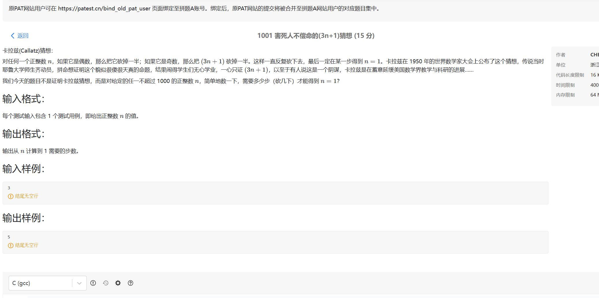

# 逻辑表达式（又叫布尔表达式）

## 与( & )、或( | )、非( ! )

* **逻辑表达式：**简单点理解就是 只有俩结果 真 或 假 的运算结果的代码语句都可以叫 逻辑表达式

* 真 或 假 在C语言没有对应的类型，但是可以用 0（假） 或 1 （真）表示逻辑表达式的结果，boolean 类型是 c++ 扩充进来的，C语言 原生没用 布尔类型。但是可以代替 用 0 和 非0

* C语言中 说的 **真就是 1** 、**假就是 0** ，可以，但是不准确。这个说法的由来可以验证，如下程序

  ```c
  #include<stdio.h>
  int main(){
      printf("!0 = %d",!0);
      printf("!5 = %d",!5);
      printf("!1 = %d",!1);
      printf("!'a' = %d",!'a');
      return 0;
  }
  ```

  

* 通过上面的程序我们可以看到 他们的结果都是 0 和 1，所以 我们 通常说的 0 是 假，1 是 真 ；但是为啥说不准确呢？就在于 我们上面的程序中 的 !5 的结果，!'a' 的结果都是 0， 说明 5 和 'a' 都是真，那么我们前面说 1 是真是不是就不准确了，所以 应该是  **0是假，非0就是真**;，所以 像 后面的 if（判断语句），while for，do while 循环这些，判断语句的结果就是逻辑表达式的结果，真或者假，只有真（true）才进入，假（false）就不进入。

# 选择分支

## if else 结构

* 第一种

  ```c
  // 第一种情况
  if( 条件){
  }else{
  }
  ```


+ 第二种

  ```c
  // 第二种情况
  if(条件){
  }else if(条件){
  }else{
  }
  ```

  **特殊 1 **

  ```c
  if()	//1
      printf();
  if()	//2
      printf();
   else	//3
       printf();
  else  //4
      printf()
  // 这种情况的 if  else 语句他们和 else  的匹配规则是 就近原则 else 只匹配和它最近的那一个 if,也就是 1 那个 if 匹配 4 else ,2 那个 if 匹配 3那个 else
  ```
  
  **特殊 2**

  ```c
  if()
      printf()
      printf()
  else
      printf()
      
  // 如果是这种结构的话，会报错else 找不到 if ，因为 if 语法中它只负责紧跟 if 后面的第一句语句(可以是 复合语句，就是大括号包括起来的)
      if(){
      printf()
      printf()
      }
  else
      printf()
      // 这样改就对了
  ```

## switch case 结构

* 语法规则

  ```c
  switch(flag){
     case'标志':{
         break;
     }
     case'标志':{
         
     }
     case'标志':{
         break;
     }
      default:{
      
      }
  }
  // flag 就是传入的参数，case'标志'：就是出现响应情况就执行 case 后的代码，case 后可以直接跟多条语句代码，但是个人建议把所有代码用{}包起来 弄成一个代码块，代码模块化，方便阅读,对于代码中的 break 选项 是可选项 它在代码中的意思就是 就是打破 让执行跳出 switch 因为如果 case 后面没有 break 的话就会在满足情况的 case 那里开始一直执行 包括 default 也会执行，或者就是一直执行到有 break 时才跳出，具体用法读者 可以使用代码验证
  ```

  

* **if else 和 switch 区别：**

   if else 适合少量分支 一般就 2-3 个 分支 推荐使用 ，但是分支一旦太多会影响程序的执行效率，而多分支 一般推荐使用 switch ，因为 switch 在多分支上执行效率 比 多分支 if 快，一般都是套用（两个一起用）

## 代码文件

* 等级判定程序.c
* 计算器.c
* 作业登记.c

# 循环

## 语法介绍

* while()

  ```c
  // 第一种
  while(flag)
      
  // 第二种
  while(flag){
      
  }
  // while、for 和 if 的语法差不了太多，也是只执行紧跟这个的第一句，如果要执行多句就要把语句用 {} 这个写成语句块的形式（复合语句）,这个 flag 是逻辑表达式的一个结果，后面讲 逻辑表达式
  ```

  

* for()

  ```c
  // 完整形态
  for( ; ; )
   
  // 或者
  for( ; ;){
      
  }
  
  // 缺项形态
  // 这个说明前面指定了 i 的初值
  for( ;i<n;i++)
   
  // 这个说明 i 退出条件在循环体里面，循环体就是要循环的内容，可以是语句块，也可以是一条语句
  for(i=0;;i++)
      
  // 这个说明循环里面有 i 变化的方式
  for(i=0;i<n;)
      
  // 这个是等价于 while的
  for(;i<n;)
      
  // 全省略,说明程序使用了 break 退出循环，或者 goto （不建议使用）
  for(;;)
  ```

  

* do while()

  ```c
  do {
      
  }while(flag)
      
  // do while 循环是先执行再判断，而我们前面介绍的是先判断再执行，所以 这个比较特殊 ，用得也很少一般，作为了解就行。 
  ```

  

## break 和 continue

* break

  ```c
  #include<stdio.h>
  int main(){
      num = 10;
      while(num){
          --num;
          printf("num = %d",num);
          if(num==3)
              break;
      }
      return 0;
  }
  // 执行之后可以再试试把 break 注释之后再执行一次
  ```

  

* continue

  ```c
  #include<stdio.h>
  int main(){
      num = 10;
      while(num){
          if(num==3)
              continue;
      	printf("num = %d",num);
          --num;
      }
      return 0;
  }
  ```

  * **continue 和 break 用法说明**：通过执行上面的程序 break 那个程序可以明显看到 当 num == 3 时 程序直接退出了。有 continue 那个程序的时候 可以看到 打印的结果少了一个 3 ，所以 break 关键字的意思还是和 switch 里面的用法一样 用来打破的，循环里面都是打破循环 while 、for 、do while 都是，而 continue 就是就是 忽略掉当前循环直接进入下一次循环。

## 第归

* 有点难懂，需要把函数讲了再讲。先留着

  那个递归的题目是：

## 代码文件

* 循环
* 乘法表.c
* 循环嵌套

