# docker

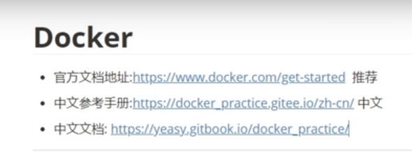

* [推荐阅读文档地址](https://yeasy.gitbook.io/docker_practice) 

* 离线阅读:

  > docker run -it --rm -p 4000:80 ccr.ccs.tencentyun.com/dockerpracticesig/docker_practice:vuepress

  或者

  > version: '3'
  >
  > 
  >
  > services:
  >
  >  docker-document:
  >
  >   image: ccr.ccs.tencentyun.com/dockerpracticesig/docker_practice:vuepress
  >
  >   container_name: docker-document
  >
  >   ports:
  >
  >    \- 4000:80
  >
  >   restart: always

* 下载docker脚本 [curl -fsSL https://get.docker.com | bash -s docker --mirror Aliyun](curl -fsSL https://get.docker.com | bash -s docker --mirror Aliyun)

## 配置中科大镜像加速（推荐）

* 我推荐中科大这个，阿里云有时候有一些玄学问题

```shell
# Ubuntu
sudo mkdir -p /etc/docker
sudo tee /etc/docker/daemon.json <<-'EOF'
{
  "registry-mirrors": ["https://docker.mirrors.ustc.edu.cn"],
  "iptables": false
}
EOF
sudo systemctl daemon-reload
sudo systemctl restart docker
sudo systemctl enable docker

# Centos
sudo mkdir -p /etc/docker
sudo tee /etc/docker/daemon.json <<-'EOF'
{
  "registry-mirrors": ["https://docker.mirrors.ustc.edu.cn"],
  "iptables": false
}
EOF
sudo systemctl daemon-reload
sudo systemctl restart docker
sudo systemctl enable docker
```

## 配置阿里云镜像加速

````shell
# Ubuntu
sudo mkdir -p /etc/docker
sudo tee /etc/docker/daemon.json <<-'EOF'
{
  "registry-mirrors": ["https://efwckkji.mirror.aliyuncs.com"],
  "iptables": false
}
EOF
sudo systemctl daemon-reload
sudo systemctl restart docker
sudo systemctl enable docker

# Centos
sudo mkdir -p /etc/docker
sudo tee /etc/docker/daemon.json <<-'EOF'
{
  "registry-mirrors": ["https://efwckkji.mirror.aliyuncs.com"],
  "iptables": false
}
EOF
sudo systemctl daemon-reload
sudo systemctl restart docker
sudo systemctl enable docker
````

## 镜像命令

````shell
docker images  # 查看本地主机上所有的镜像

REPOSITORY    TAG       IMAGE ID       CREATED        SIZE
mysql         latest    5c62e459e087   3 days ago     556MB
ubuntu        latest    9873176a8ff5   9 days ago     72.7MB
hello-world   latest    d1165f221234   3 months ago   13.3kB
centos        latest    300e315adb2f   6 months ago   209MB
# 上面参数的的解释
REPOSITORY	 镜像仓库源
TAG			镜像标签
IMAGE ID	镜像id
CREATED		镜像的创建时间
SIZE		镜像的大小

# 可选项
-a，--all		# 列出所有镜像
-q，--quiet		# 只显示镜像的id
````

**docker search 搜索镜像**

```shell
root@wflin-server:/home/wflin# docker search mysql
NAME                              DESCRIPTION                                     STARS     OFFICIAL   AUTOMATED
mysql                             MySQL is a widely used, open-source relation…   11042     [OK]       
mariadb                           MariaDB Server is a high performing open sou…   4186      [OK]     

# 可选项，通过收藏来过滤
-- filter=stars=3000	# 搜索出来的收藏大于3000的

root@wflin-server:/home/wflin# docker search mysql --filter=stars=3000
NAME      DESCRIPTION                                     STARS     OFFICIAL   AUTOMATED
mysql     MySQL is a widely used, open-source relation…   11042     [OK]       
mariadb   MariaDB Server is a high performing open sou…   4186      [OK]       
root@wflin-server:/home/wflin# docker search mysql --filter=stars=4000
NAME      DESCRIPTION                                     STARS     OFFICIAL   AUTOMATED
mysql     MySQL is a widely used, open-source relation…   11042     [OK]       
mariadb   MariaDB Server is a high performing open sou…   4186      [OK]       
```

**docker pull**

```shell
# 下载镜像 docker pull 镜像名 [:tag] 
root@wflin-server:/home/wflin	# docker pull mysql
Using default tag: latest  	# 如果不写 tag 默认下载最新的
b4d181a07f80: Pull complete  # 分层下载，docker image核心，联合文件系统
a462b60610f5: Pull complete 
578fafb77ab8: Pull complete 
524046006037: Pull complete 
d0cbe54c8855: Pull complete 
aa18e05cc46d: Pull complete 
32ca814c833f: Pull complete 
9ecc8abdb7f5: Pull complete 
ad042b682e0f: Pull complete 
71d327c6bb78: Pull complete 
165d1d10a3fa: Pull complete 
2f40c47d0626: Pull complete 
Digest: sha256:52b8406e4c32b8cf0557f1b74517e14c5393aff5cf0384eff62d9e81f4985d4b	# 签名
Status: Downloaded newer image for mysql:latest
docker.io/library/mysql:latest	# 真实地址

# 等价于它
docker pull mysql
docker pull docker.io/library/mysql:latest

# 指定版本下载
docker pull mysql:5.7
root@wflin-server:/home/wflin# docker pull mysql:5.7
5.7: Pulling from library/mysql
b4d181a07f80: Already exists 
a462b60610f5: Already exists 
578fafb77ab8: Already exists 
524046006037: Already exists 
d0cbe54c8855: Already exists 
aa18e05cc46d: Already exists 
32ca814c833f: Already exists 
52645b4af634: Pull complete 
bca6a5b14385: Pull complete 
309f36297c75: Pull complete 
7d75cacde0f8: Pull complete 
Digest: sha256:1a2f9cd257e75cc80e9118b303d1648366bc2049101449bf2c8d82b022ea86b7
Status: Downloaded newer image for mysql:5.7
docker.io/library/mysql:5.7
```


**docker rmi 删除镜像**

```shell
root@wflin-server:/home/wflin# docker rmi -f 镜像id      #删除指定的容器

#删除多个容器
root@wflin-server:/home/wflin# docker rmi -f 镜像id 容器id 容器id 

# 删除全部的容器
root@wflin-server:/home/wflin# docker rmi -f $(docker images -aq)	 
```

## 容器命令

**说明：有了镜像才可以创建容器，Linux，下载一个centos来测试学习**

````shell
docker pull centos
````

**新建容器并启动**

```shell
docker run [可选参数] image

# 参数说明
--name="name"		容器名字，tomacat01  tomacat02 ...
-d 					后台方式运行
-it					使用交互方式运行，进入容器查看内容
-p					指定容器端口 -p  8080：8080
	-p ip：主机端口：容器端口
	-p 主机端口：容器端口（常用）
	-p 容器端口
	容器端口
-p					随机指定端口


# 测试
# 启动并进入容器
root@wflin-server:/home/wflin# docker run -it centos /bin/bash
[root@74084deb4db1 /]# 

#查看容器内的centos，基础版本，许多命令不完善
[root@74084deb4db1 /]# ls
bin  etc   lib	  lost+found  mnt  proc  run   srv  tmp  var
dev  home  lib64  media       opt  root  sbin  sys  usr


# 退出容器
[root@74084deb4db1 /]# exit
exit
root@wflin-server:/home/wflin# ls
root@wflin-server:/home/wflin# 

# 进入正在运行的容器
[root/wflin]# docker attach ID
```

**列出所有的运行容器**

```shell
# docker ps 命令
	# 列出当前正在运行的容器
-a  # 列出当前正在运行的容器+带出历史运行过的容器
-n=?	# 显示最近创建的容器
-q 		# 只显示容器的编号

root@wflin-server:/home/wflin# docker ps
CONTAINER ID   IMAGE     COMMAND   CREATED   STATUS    PORTS     NAMES
root@wflin-server:/home/wflin# docker ps -a 
CONTAINER ID   IMAGE          COMMAND                  CREATED             STATUS                       PORTS     NAMES
74084deb4db1   centos         "/bin/bash"              5 minutes ago       Exited (130) 2 minutes ago             laughing_rubin
d715695fa465   5c62e459e087   "docker-entrypoint.s…"   About an hour ago   Created                                mysql-test
65c14e0a392c   9873176a8ff5   "bash"                   2 hours ago         Exited (0) 2 hours ago                 inspiring_goldstine
92c6b1d7ed88   centos         "/bin/bash"              2 hours ago         Exited (0) 2 hours ago                 mystifying_almeida
da44274c6bc6   centos         "/bin/bash"              2 hours ago         Exited (0) 2 hours ago                 sweet_gould
4fd6fabed535   d1165f221234   "/hello"                 2 hours ago         Exited (0) 2 hours ago                 zealous_moore
4f866214a820   d1165f221234   "/hello"                 2 hours ago         Exited (0) 2 hours ago                 cool_einstein
3e6471788607   d1165f221234   "/hello"                 2 hours ago         Exited (0) 2 hours ago                 vibrant_edison
root@wflin-server:/home/wflin# 

```

**退出容器**

```shell
exit	# 直接容器停止并退出
ctrl + p + q 	# 容器不停止
```

**删除容器**

```shell
docker rm 容器id		# 删除指定容器，不能删除正在运行的容器。如果要强制删除就用rm -f
docker rm -f $(docker ps -aq)	# 删除所有镜像
docker ps -aq|xargs docker rm	# 删除所有容器
```

**启动和停止容器的操作**

```shell
docker start 容器id	#启动容器
docker restart 容器id	#重启容器
docker stop 容器id	# 停止容器
docker kill 容器id	# 杀掉容器
```

## 常用的其他命令

* **后台启动容器**

容器卷技术

## 实战安装mysql

````shell
# 下载 mysql 镜像
docker pull mysql:5.7
# 				外部端口，内部端口		挂在在外部目录	挂载的内部目录									环境配置
docker run -d -p 3306:3306 -v /home/mysql/config5:/etc/mysqlconf.d -v /home/mysql/data5:/var/lib/mysql -e MYSQL_ROOT_PASSWORD=nba666 --name mysql-5.7 mysql:5.7

docker run -d -p 3306:3306 -v /home/mysql/config:/etc/mysqlconf.d -v /home/mysql/data:/var/lib/mysql -e MYSQL_ROOT_PASSWORD=nba666 --name mysql-8.0 mysql:8.0
````

## 运行容器端口占用 踩坑

````shell
# 查看端口占用情况
netstat -tanlp

# 筛选出 3306 的端口
sudo netstat -nlptu | grep 3306

# 解决端口占用问题 
kill pid (占用端口的pid)

# 进入正在运行的容器
sudo docker attach 容器ID  
````

````shell
# mysql 创建y
use mysql
select Host,User from mysql.user;

create user DuNa identified by 'Duna123';

grant all privileges on *.* to root@'%' with grant option
````

Dockerfile 构建过程

## 关键保留字

**基础知识**

1. 每个保留关键字（指令）都必须是大写字母
2. 执行从上到下顺序执行
3. “ # ”表示注释
4. 每一个指令都会提交一个性的镜像层，并提交！
5. dockerfile是面向开发的，我们以后要发布项目，做镜像，就需要编写dockerfile文件，这个文件十分简单！docker 镜像逐渐成为企业交付的标准，必须掌握！
6. Dockerfile：构建文件，定义了一切的步骤，源代码
7. Dockerimages：通过dockerfile 构建生成的一个镜像，最终发布和运行的产品，原来是一个jar，war 包执行起来，全部都要变成容器

## DockerFile

### Docker 文件结构视图

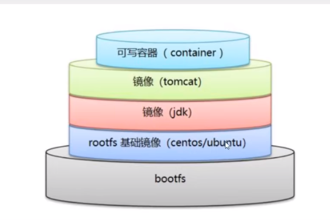

### Dokcerfile 指令


```shell
FROM				# 基础镜像，一切从这里开始构建
MAINTAINER			# 镜像是谁写的，姓名+邮箱
RUN					# 镜像构建的时候西药运行的命令
ADD 				# 步骤：tomcat 镜像，这个 tomcat 压缩包
WORKDIR				# 镜像的工作目录
VOLUEME				# 挂载目录位置
EXPOSE				# 暴露端口配置 也可通过 -p 暴露端口
CMD					# 指定这个容器启动的时候需要运行的命令【只有最后一个会生效，可以被替代】
ENTRYPOINT			# 指定这个容器启动的时候需要运行的命令【可以追加命令】
ONBUILD				# 当构建一个被继承 DockerFile 这个时候就会运行 ONBUILD 的指令，触发指令
COPY				# 类似 add 命令，将文件拷贝到镜像中
ENV					# 构建的时候设置环境变量
```

### 定制镜像测试

Docker Hub 中 99% 的镜像都是从基础镜像构建过来的

1. 编写 dockerfile 文件，我这里的文件名：`mycentos`

   ```shell
   FROM centos:7
   # 这个说明可选了《不是必须》.
   MAINTAINER	wflin<test.com>
   
   ENV MYPATH /usr/local
   WORKDIR ${MYPATH}
   
   # 要执行的指令
   RUN yum update -n
   RUN yum -y install vim 
   RUN yum -y install net-tools
   
   EXPOSE 80
   # 输出的信息，因为前面说 CMD 只有最后一个会生效，所以应该只会出现 /bin/bash
   CMD echo ${MYPATH}
   CMD echo "--------end-----"
   CMD /bin/bash
   ```

   

2. 构建镜像的指令

   ```shell
   # 构建指令
   docker build -f  mycentos -t mycentos : 0.1 .
   
   #参数说明：
    -f 代表 指定 dockerfile 文件
    -t tag，生成名字和版本
    最后还有一个 .
    
    # 构建完成显示 
   Removing intermediate container eaa8273e8d38
    ---> 3754b0b27b2a
   Step 7/10 : EXPOSE 80
    ---> Running in b5205972ddad
   Removing intermediate container b5205972ddad
    ---> e1572c725b1c
   Step 8/10 : CMD echo ${MYPATH}
    ---> Running in 5bec5095048a
   Removing intermediate container 5bec5095048a
    ---> 4373e1577764
   Step 9/10 : CMD echo "--------end-----"
    ---> Running in 6ba156902517
   Removing intermediate container 6ba156902517
    ---> edd1a48d3657
   Step 10/10 : CMD /bin/bash
    ---> Running in 3301bd6a5ee4
   Removing intermediate container 3301bd6a5ee4
    ---> 5432537134ad
   Successfully built 5432537134ad
   Successfully tagged mycentos:0.1
   ```

3. 查看构建镜像

   ```shell
   root@wflin-server:~# docker images
   REPOSITORY   TAG       IMAGE ID       CREATED          SIZE
   mycentos     0.1       5432537134ad   39 seconds ago   591MB
   nginx        latest    605c77e624dd   3 months ago     141MB
   redis        latest    7614ae9453d1   3 months ago     113MB
   mysql        latest    3218b38490ce   4 months ago     516MB
   centos       7         eeb6ee3f44bd   7 months ago     204MB
   ```

4. 运行构建好的镜像

   ```shell
   root@wflin-server:~# docker run -it mycentos:0.1
   [root@6c63c9bd9365 local]# pwd
   /usr/local
   [root@6c63c9bd9365 local]# 
   
   
   # 直接到了 工作目录 /usr/local,指令都能用
   ```

5. docker history  imageID 显示构建历史（构建过程）

   ```shell
   root@wflin-server:~# docker history 5432537134ad
   IMAGE          CREATED         CREATED BY                                      SIZE      COMMENT
   5432537134ad   7 minutes ago   /bin/sh -c #(nop)  CMD ["/bin/sh" "-c" "/bin…   0B       
   edd1a48d3657   7 minutes ago   /bin/sh -c #(nop)  CMD ["/bin/sh" "-c" "echo…   0B       
   4373e1577764   7 minutes ago   /bin/sh -c #(nop)  CMD ["/bin/sh" "-c" "echo…   0B       
   e1572c725b1c   7 minutes ago   /bin/sh -c #(nop)  EXPOSE 80                    0B       
   3754b0b27b2a   7 minutes ago   /bin/sh -c yum -y install net-tools             166MB   
   d16062eddd70   7 minutes ago   /bin/sh -c yum -y install vim                   221MB   
   e1733b608785   9 minutes ago   /bin/sh -c #(nop) WORKDIR /usr/local            0B       
   1d90358fa417   9 minutes ago   /bin/sh -c #(nop)  ENV MYPATH=/usr/local        0B       
   cc918b6281e4   9 minutes ago   /bin/sh -c #(nop)  MAINTAINER wflin<test.com>   0B       
   eeb6ee3f44bd   7 months ago    /bin/sh -c #(nop)  CMD ["/bin/bash"]            0B       
   <missing>      7 months ago    /bin/sh -c #(nop)  LABEL org.label-schema.sc…   0B       
   <missing>      7 months ago    /bin/sh -c #(nop) ADD file:b3ebbe8bd304723d4…   204MB   
   root@wflin-server:~# 
   ```

6. 例如查看 nginx 的构建过程,可以显示官方镜像的构建过程

   ```shell
   root@wflin-server:~# docker history nginx
   IMAGE          CREATED        CREATED BY                                      SIZE      COMMENT
   605c77e624dd   3 months ago   /bin/sh -c #(nop)  CMD ["nginx" "-g" "daemon…   0B        <missing>      3 months ago   /bin/sh -c #(nop)  STOPSIGNAL SIGQUIT           0B        <missing>      3 months ago   /bin/sh -c #(nop)  EXPOSE 80                    0B        <missing>      3 months ago   /bin/sh -c #(nop)  ENTRYPOINT ["/docker-entr…   0B        <missing>      3 months ago   /bin/sh -c #(nop) COPY file:09a214a3e07c919a…   4.61kB    <missing>      3 months ago   /bin/sh -c #(nop) COPY file:0fd5fca330dcd6a7…   1.04kB    <missing>      3 months ago   /bin/sh -c #(nop) COPY file:0b866ff3fc1ef5b0…   1.96kB    <missing>      3 months ago   /bin/sh -c #(nop) COPY file:65504f71f5855ca0…   1.2kB     <missing>      3 months ago   /bin/sh -c set -x     && addgroup --system -…   61.1MB    <missing>      3 months ago   /bin/sh -c #(nop)  ENV PKG_RELEASE=1~bullseye   0B        <missing>      3 months ago   /bin/sh -c #(nop)  ENV NJS_VERSION=0.7.1        0B        <missing>      3 months ago   /bin/sh -c #(nop)  ENV NGINX_VERSION=1.21.5     0B        <missing>      4 months ago   /bin/sh -c #(nop)  LABEL maintainer=NGINX Do…   0B        <missing>      4 months ago   /bin/sh -c #(nop)  CMD ["bash"]                 0B        <missing>      4 months ago   /bin/sh -c #(nop) ADD file:09675d11695f65c55…   80.4MB    root@wflin-server:~# 
   
   ```

### CMD 和 ENTRYPOINT

```shell
CMD					# 指定这个容器启动的时候需要运行的命令【只有最后一个会生效，可以被替代】
ENTRYPOINT			# 指定这个容器启动的时候需要运行的命令【可以追加命令】
```

* 测试CMD

  ```shell
  #vim cmdcentos
  FROM centos:7
  CMD ["ls","-a"]
  
  #构建镜像
  docker build -f cmdcentos -t cmdcentos:0.1 .
  
  # run 镜像
  docker run f76ee2630109
  
  # 结果
  .
  ..
  .dockerenv
  anaconda-post.log
  bin
  dev
  etc
  home
  lib
  lib64
  ... ...
  
  # 加参数
  docker run f76ee2630109 -l
  # 结果
  docker: Error response from daemon: failed to create shim: OCI runtime create failed: container_linux.go:380: starting container process caused: exec: "-l": executable file not found in $PATH: unknown.
  ERRO[0000] error waiting for container: context canceled
  
  # 原因：cmd的情况下， -l 替换了 CMD ["ls","-a"] 命令，-l 不是命令，所以报错
  
  # 例如：
  root@wflin-server:~# docker run 0d3e566bc0a5 ls -l
  total 56
  -rw-r--r--   1 root root 12114 Nov 13  2020 anaconda-post.log
  lrwxrwxrwx   1 root root     7 Nov 13  2020 bin -> usr/bin
  drwxr-xr-x   5 root root   340 Apr 20 02:52 dev
  drwxr-xr-x   1 root root  4096 Apr 20 02:52 etc
  drwxr-xr-x   2 root root  4096 Apr 11  2018 home
  lrwxrwxrwx   1 root root     7 Nov 13  2020 lib -> usr/lib
  lrwxrwxrwx   1 root root     9 Nov 13  2020 lib64 -> usr/lib64
  drwxr-xr-x   2 root root  4096 Apr 11  2018 media
  drwxr-xr-x   2 root root  4096 Apr 11  2018 mnt
  drwxr-xr-x   2 root root  4096 Apr 11  2018 opt
  ... ...
  ```

* 测试 ENTRYPOINT

  ```shell
  # 把上面的 cmdcentos 的 cmd 改为 entropoint 试试
  # 继续构建运行
  
  #vim cmdcentos
  FROM centos:7
  ENTRYPOINT ["ls","-a"]
  
  # 构建忽略
  # 运行
  root@wflin-server:~# docker run 00a71f921e2a
  .
  ..
  .dockerenv
  anaconda-post.log
  bin
  dev
  etc
  home
  lib
  lib64
  media
  mnt
  opt
  proc
  root
  run
  sbin
  srv
  sys
  ... ...
  
  # 追加指令
  root@wflin-server:~# docker run 00a71f921e2a -l
  total 64
  drwxr-xr-x   1 root root  4096 Apr 20 03:00 .
  drwxr-xr-x   1 root root  4096 Apr 20 03:00 ..
  -rwxr-xr-x   1 root root     0 Apr 20 03:00 .dockerenv
  -rw-r--r--   1 root root 12114 Nov 13  2020 anaconda-post.log
  lrwxrwxrwx   1 root root     7 Nov 13  2020 bin -> usr/bin
  drwxr-xr-x   5 root root   340 Apr 20 03:00 dev
  drwxr-xr-x   1 root root  4096 Apr 20 03:00 etc
  drwxr-xr-x   2 root root  4096 Apr 11  2018 home
  lrwxrwxrwx   1 root root     7 Nov 13  2020 lib -> usr/lib
  lrwxrwxrwx   1 root root     9 Nov 13  2020 lib64 -> usr/lib64
  drwxr-xr-x   2 root root  4096 Apr 11  2018 media
  ...  ...
  ```

### 实战：Tomcat 镜像

* 准备工作

  1. 准备镜像文件 `tomcat` 压缩包，`jdk`的压缩包

     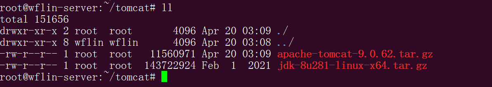

  2. 编写 `dockerfile` 文件，官方命名 `Dockerfile`，build 会自动寻找这个文件，就不用 -f 指定了

     ```shell
     # 初始镜像
     FROM centos:7
     
     # 镜像作者信息
     MAINTAINER wflin<test.com>
     
     # 只是拷贝文件，不会解压
     COPY readme.txt /usr/local/readme.txt
     
     # 添加jdk
     ADD jdk-8u281-linux-x64.tar.gz /usr/local/
     
     # 添加 tomcat
     ADD apache-tomcat-9.0.62.tar.gz /usr/local/
     
     # 安装 vim
     RUN yum -y install vim
     
     # 设置工作目录
     ENV MYPATH /usr/local
     WORKDIR $MYPATH
     
     # 设置Java环境变量
     ENV JAVA_HOME /usr/local/jdk1.8.0_281
     ENV CLASSPATH $JAVA_HOME/lib/dt.jar:$JAVA_HOME/lib/tools.jar
     ENV CATALINA_HOME  /usr/local/apache-tomcat-9.0.62
     ENV CATALINA_BASH /usr/local/apache-tomcat-9.0.62
     ENV PATH $PATH:$JAVA_HOME/bin:$CATALINA_HOME/lib:$CATALINA_HOME/bin
     
     # 暴露端口
     EXPOSE 80
     # 输出信息
     CMD /usr/local/apache-tomcat-9.0.62/bin/startup.sh && tail -f /usr/local/apache-tomcat-9.0.62/logs/catalina.out
     ```

     

  3. 构建镜像

     >docker build -t mytomcat  .

  4. 查看镜像

     ```shell
     REPOSITORY   TAG       IMAGE ID       CREATED              SIZE
     mytomcat     latest       cf6cb7c23e98   About a minute ago   798MB
     centos       7         eeb6ee3f44bd   7 months ago         204MB
     root@wflin-server:~/tomcat# 
     ```

  5. 使用镜像

     ```shell
     root@wflin-server:~/tomcat# docker run -d -p8080:8080 --name diytomcat -v /home/wflin/tomcat/test/:/usr/local/apache-tomcat-9.0.62/webapps/test -v /home/wflin/tomcat/tomcatlogs/:/usr/local/apache-tomcat-9.0.62/logs mytomcat
     
     # 成功进入镜像
     root@wflin-server:~/tomcat# docker exec -it  diytomcat /bin/bash
     [root@ab92e0f3fff4 local]# 
     ```

  6. 测试镜像

     >访问： 在容器外部访问： curl 127.0.0.1:8080

  7. 发布项目(在网上找的)

     * web.xml

       ```xml
       <?xml version="1.0" encoding="UTF-8"?>
       <web-app version="2.4" 
           xmlns="http://java.sun.com/xml/ns/j2ee" 
           xmlns:xsi="http://www.w3.org/2001/XMLSchema-instance"
           xsi:schemaLocation="http://java.sun.com/xml/ns/j2ee 
               http://java.sun.com/xml/ns/j2ee/web-app_2_4.xsd">
       </web-app>
       ```

     * index.jsp

       ```jsp
       <%@ page contentType="text/html;charset=UTF-8" language="java" %>
           <!DOCTYPE html>
           <html lang="en">
       
           <head>
               <meta charset="UTF-8">
               <meta http-equiv="X-UA-Compatible" content="IE=edge">
               <meta name="viewport" content="width=device-width, initial-scale=1.0">
               <title>Document</title>
           </head>
       
           <body>
               <h1>hello world</h1>
               <%
               	System.out.println("wflin docker");
               %>
           </body>
       
           </html>
       ```

     * >访问  curl 127.0.0.1:8080/test

     * 查看运行日志

       ```shell
       root@wflin-server:/home/wflin/tomcat/tomcatlogs# tail catalina.out 
       wflin test log
       wflin test log
       wflin test log
       wflin test log
       wflin test log
       wflin test log
       ```

### 向 docker hub 发布镜像

>docker hub

1. 在 docker hub 注册自己的账号！

   ```shell
   root@wflin-server:~# docker login --help
   
   Usage:  docker login [OPTIONS] [SERVER]
   
   Log in to a Docker registry.
   If no server is specified, the default is defined by the daemon.
   
   Options:
     -p, --password string   Password
         --password-stdin    Take the password from stdin
     -u, --username string  
   ```

   

2. 确定这个账号可以登陆

3. 在自己服务器上提交自己的镜像

   >登陆完毕就可以提交镜像了，就是一步 docker push user/image : tag【这样好区分，不然多半会提交被拒绝】

### 提交到 阿里云容器仓库

1. 登陆阿里云

   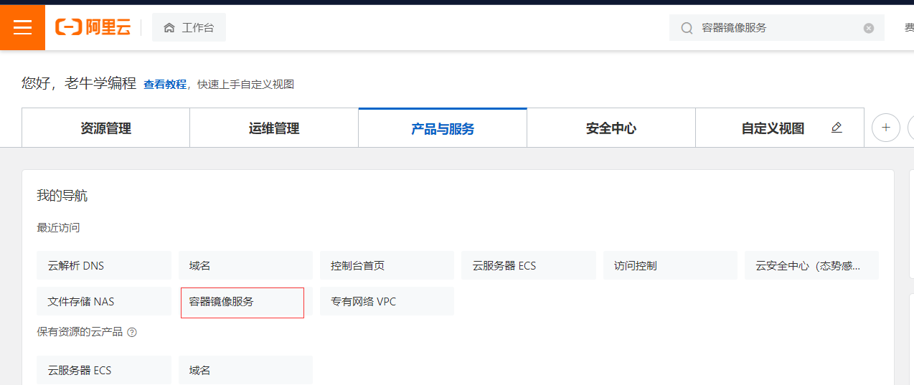

2. 找到容器镜像服务 并创建 容器镜像服务，个人版本好像是免费的

   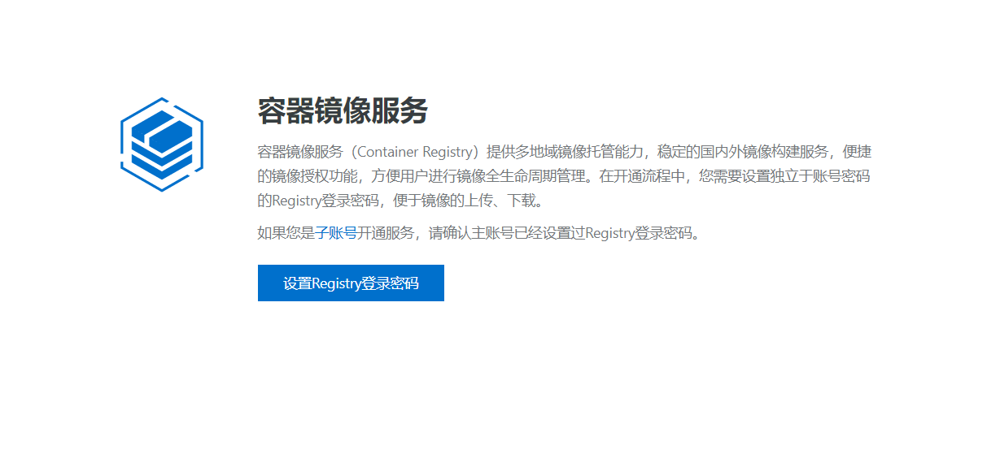

3. 创建好之后就是这个样子

   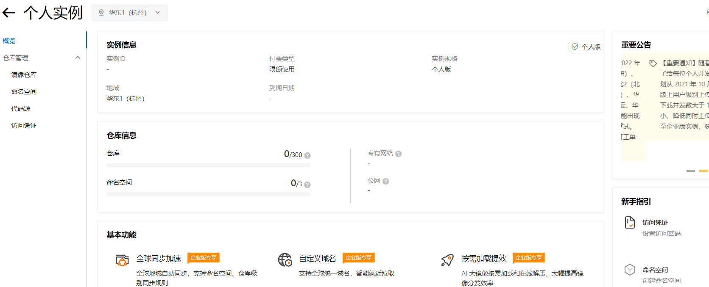

4. 创建一个私有命名空间

   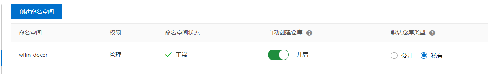

5. 再创建一个镜像仓库,选择本地仓库

   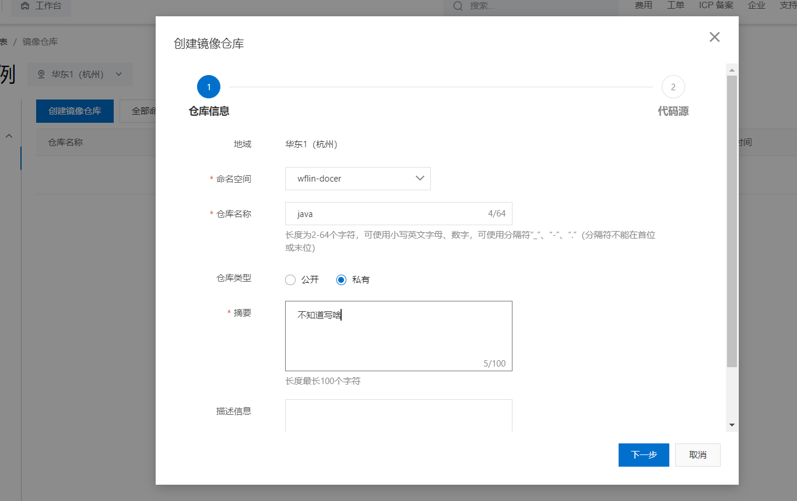

6. 根据提示操作就行（很详细）

7. 登陆成功

   ```shell
   root@wflin-server:~# docker login --username=user registry.cn-hangzhou.aliyuncs.com
   Password: 
   WARNING! Your password will be stored unencrypted in /root/.docker/config.json.
   Configure a credential helper to remove this warning. See
   https://docs.docker.com/engine/reference/commandline/login/#credentials-store
   
   Login Succeeded
   root@wflin-server:~# 
   ```

8. >注意：提交的镜像 的名字 user/image : tag 
   >
   >>docker push wflin/tomcat : 1.0

## Docker 网络

### 理解 Docker 0

>测试：获取 IP 地址 ifconfig 或者 ip addr

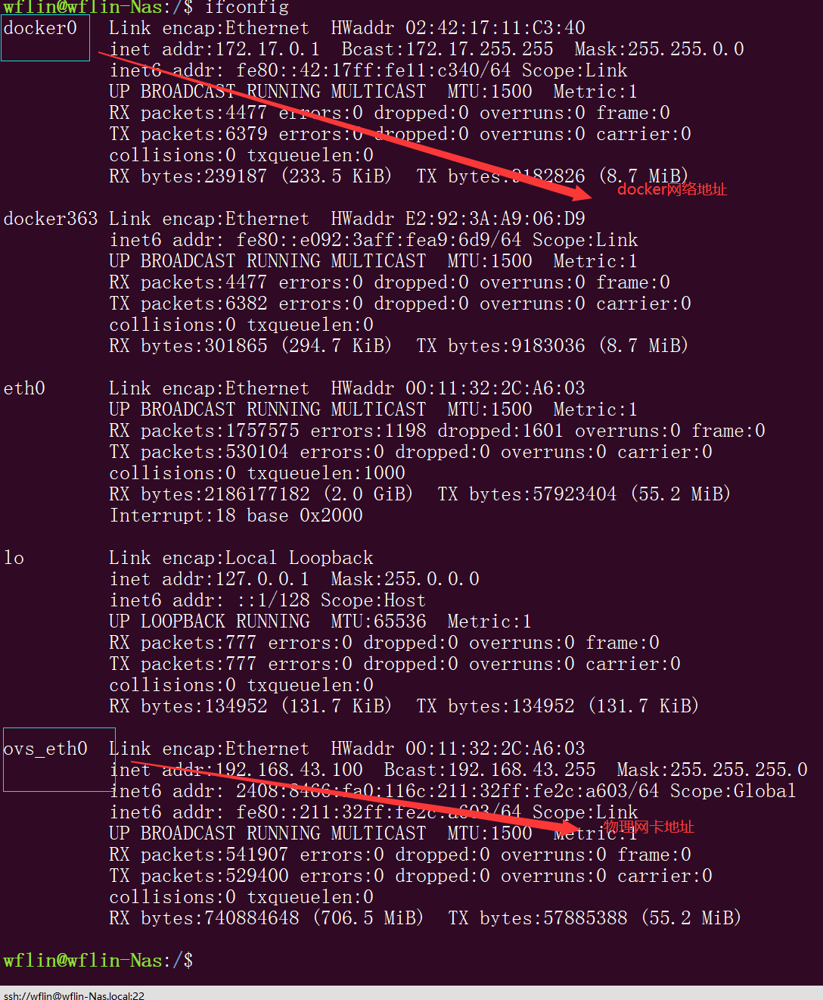

>容器内部网络情况，外部可以 ping 通 docker 外部

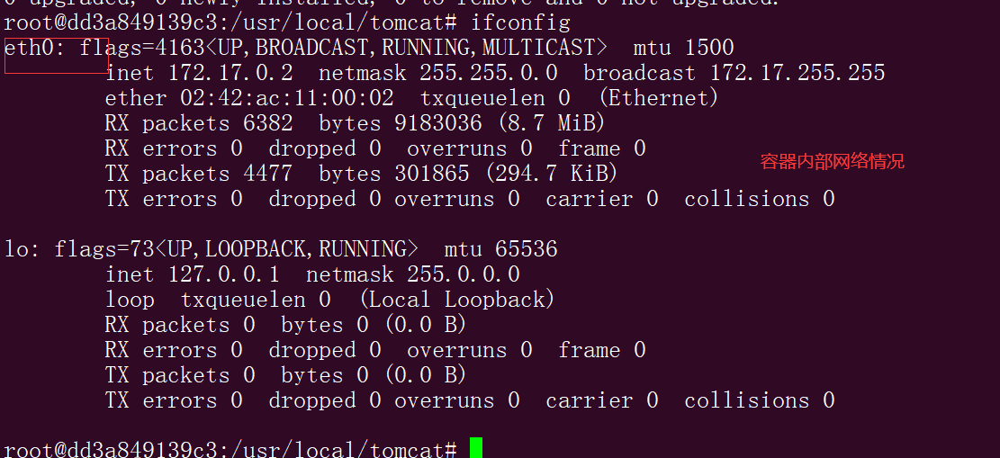

>原理

1. 每启动一个 docker 容器，docker 会给 docker 容器分配一个 IP ，只要安装了 docker，就会有一个 docker0的桥接模式的网卡，使用的技术是 `evth-pair` 技术

   `evth-pair`：就是一对虚拟设备接口，他们都是成对出现的,一端连接协议，一端彼此相连。所以就可以通

2. docker0 就是一个网桥（可以理解为一个路由）所有docker 容器之间的通信都是通过 docker0路由转发（小型局域网） 通信。

3. 可以看图示

   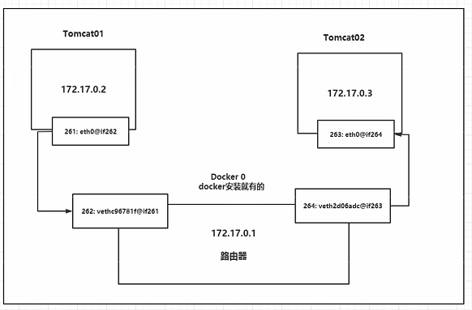

### --link

>项目不重启的情况下，数据库的IP换掉了，可以通过容器别名 --link ping 通容器

* 启动俩容器：

  >docker run -d -P --name tomcat01 tomcat
  >
  >docker run -d -P --name tomcat02 tomcat

* 尝试  `ping` 连接,连接不通

  ```shell
  root@wflin-server:~# docker exec -it tomcat01 ping tomcat02 
  ```

  

* 再启动一个 tomcat 容器

  >docker run -d -P --name tomcat03 --link tomcat02 tomcat

* 用 `tomcat03 ping tomcat02`

  ```shell
  docker exec -it tomcat03 ping tomcat02 #可以通
  docker exec -it tomcat02 ping tomcat03 #可以通不了
  ```

### 自定义网络

> ​	docker0 局限性太大

>查看所有 docker 网络

```shell
root@wflin-server:~# docker network ls
NETWORK ID     NAME      DRIVER    SCOPE
fe4a77565263   bridge    bridge    local
bc5dacdb5f8b   host      host      local
edd3947c7f0a   none      null      local
root@wflin-server:~# 
```

>网络模式

* bridge：桥接 docker（默认，一般自己也用）
* none：不配置网络
* host：和宿主机共享
* container：容器网络连通（用得少）

>网络可以选项指令

```shel
root@wflin-server:~# docker network --help

Usage:  docker network COMMAND

Manage networks

Commands:
  connect     Connect a container to a network
  create      Create a network
  disconnect  Disconnect a container from a network
  inspect     Display detailed information on one or more networks
  ls          List networks
  prune       Remove all unused networks
  rm          Remove one or more networks

Run 'docker network COMMAND --help' for more information on a command.
root@wflin-server:~# 
```

> 创建网络

```shell
# 我们直接启动命令 --net bridge，而这个就是我们的 docker0
docker run -d -P --name tomcat01 tomcat
docker run -d -P --name tomcat01 --net bridge tomcat

# docker0 的特点。默认的，不能被域名访问，--link 可以打通直连

# 自定义网络
```

>创建网络指令

```shell
root@wflin-server:~# docker network create --help

Usage:  docker network create [OPTIONS] NETWORK
Create a network

Options:
      --attachable           Enable manual container attachment
      --aux-address map      Auxiliary IPv4 or IPv6 addresses used by Network
                             driver (default map[])
      --config-from string   The network from which to copy the configuration
      --config-only          Create a configuration only network
  -d, --driver string        Driver to manage the Network (default "bridge")
      --gateway strings      IPv4 or IPv6 Gateway for the master subnet
      --ingress              Create swarm routing-mesh network
      --internal             Restrict external access to the network
      --ip-range strings     Allocate container ip from a sub-range
      --ipam-driver string   IP Address Management Driver (default "default")
      --ipam-opt map         Set IPAM driver specific options (default map[])
      --ipv6                 Enable IPv6 networking
      --label list           Set metadata on a network
  -o, --opt map              Set driver specific options (default map[])
      --scope string         Control the network's scope
      --subnet strings       Subnet in CIDR format that represents a network segment
root@wflin-server:~# 
```

>创建网络

```shell
# --driver 网络模式 
# --subnet 子网网段和掩码 
# --gateway 网关 网络名字

root@wflin-server:~# docker network create --driver bridge --subnet 192.168.0.0/16 --gateway 192.168.0.1 mynet
db6d7453eebebef2b30695b1576cf6f1d53b472e1fd1ef92ac2256ebbddf5d94
root@wflin-server:~#
```

>查看创建的网络

```shell
root@wflin-server:~# docker network ls
NETWORK ID     NAME      DRIVER    SCOPE
fe4a77565263   bridge    bridge    local
bc5dacdb5f8b   host      host      local
db6d7453eebe   mynet     bridge    local    # 自己的网络创建成功
edd3947c7f0a   none      null      local
root@wflin-server:~# 
```

> 查看创建网络的详情

```
root@wflin-server:~# docker network inspect mynet
[
    {
        "Name": "mynet",
        "Id": "db6d7453eebebef2b30695b1576cf6f1d53b472e1fd1ef92ac2256ebbddf5d94",
        "Created": "2022-04-20T08:21:15.525137543Z",
        "Scope": "local",
        "Driver": "bridge",
        "EnableIPv6": false,
        "IPAM": {
            "Driver": "default",
            "Options": {},
            "Config": [
                {
                    "Subnet": "192.168.0.0/16",
                    "Gateway": "192.168.0.1"
                }
            ]
        },
        "Internal": false,
        "Attachable": false,
        "Ingress": false,
        "ConfigFrom": {
            "Network": ""
        },
        "ConfigOnly": false,
        "Containers": {},
        "Options": {},
        "Labels": {}
    }
]
root@wflin-server:~# 
```

>网络创建完毕

>发布容器到创建的网络

```shell
# 运行了两个 nginx 【tomcat 太大，伤不起】
root@wflin-server:~# docker run -d -P --name nginx01 --net mynet nginx
1e813d36e0e8b11368589b36ff2364c840cb2f302fc54f0ea57802fc4953cd39
root@wflin-server:~# docker run -d -P --name nginx02 --net mynet nginx
84e7c0daa060bc40779a26cd6605a5984737646977408d88f31d5afa980d0fbc
root@wflin-server:~# 

# 查看 mynet 网络
root@wflin-server:~# docker network inspect mynet
[
    {
        "Name": "mynet",
        "Id": "db6d7453eebebef2b30695b1576cf6f1d53b472e1fd1ef92ac2256ebbddf5d94",
        "Created": "2022-04-20T08:21:15.525137543Z",
        "Scope": "local",
        "Driver": "bridge",
        "EnableIPv6": false,
        "IPAM": {
            "Driver": "default",
            "Options": {},
            "Config": [
                {
                    "Subnet": "192.168.0.0/16",
                    "Gateway": "192.168.0.1"
                }
            ]
        },
        "Internal": false,
        "Attachable": false,
        "Ingress": false,
        "ConfigFrom": {
            "Network": ""
        },
        "ConfigOnly": false,
        
        # 这里就有 nginx01 和 nginx02 的信息
        "Containers": {
            "1e813d36e0e8b11368589b36ff2364c840cb2f302fc54f0ea57802fc4953cd39": {
                "Name": "nginx01",
                "EndpointID": "014c4b1bee8accafb4bd61af1ab604cfdfb40e2f0daf3662471d8aab1bfcc3bc",
                "MacAddress": "02:42:c0:a8:00:02",
                "IPv4Address": "192.168.0.2/16",
                "IPv6Address": ""
            },
            "84e7c0daa060bc40779a26cd6605a5984737646977408d88f31d5afa980d0fbc": {
                "Name": "nginx02",
                "EndpointID": "abc06f8372d33671196a1031f93865107ea2ce8a58586ba3290f0c79057dbd4e",
                "MacAddress": "02:42:c0:a8:00:03",
                "IPv4Address": "192.168.0.3/16",
                "IPv6Address": ""
            }
        },
        "Options": {},
        "Labels": {}
    }
]
root@wflin-server:~# ^C
```

>这个两个 nginx  互 ping 一下

```shell
# 由于 nginx 没有 ping 工具，所以无法使用 ping 功能
# 所以需要安装一下
root@wflin-server:~# docker exec -it  nginx01 apt-get -y install inetutils-ping
root@wflin-server:~# docker exec -it  nginx02 apt-get -y install inetutils-ping

# nginx02 ping nginx01
root@wflin-server:~# docker exec -it nginx02 ping nginx01
PING nginx01 (192.168.0.2): 56 data bytes
64 bytes from 192.168.0.2: icmp_seq=0 ttl=64 time=0.597 ms
64 bytes from 192.168.0.2: icmp_seq=1 ttl=64 time=0.053 ms

# nginx01 ping nginx02
root@wflin-server:~# docker exec -it nginx01 ping nginx02
PING nginx02 (192.168.0.3): 56 data bytes
64 bytes from 192.168.0.3: icmp_seq=0 ttl=64 time=0.042 ms
64 bytes from 192.168.0.3: icmp_seq=1 ttl=64 time=0.091 ms
```

### 网络连通

* > docker network --help

```shell
root@wflin-server:~# docker network --help

Usage:  docker network COMMAND
Manage networks

Commands:
  connect     Connect a container to a network  # 把一个容器连接到一个网络
  create      Create a network
  disconnect  Disconnect a container from a network
  inspect     Display detailed information on one or more networks
  ls          List networks
  prune       Remove all unused networks
  rm          Remove one or more networks

Run 'docker network COMMAND --help' for more information on a command.
root@wflin-server:~# 
```

* > docker network  connet --help

```shell
root@wflin-server:~# docker network connect  --help

Usage:  docker network connect [OPTIONS] NETWORK CONTAINER
Connect a container to a network

Options:
      --alias strings           Add network-scoped alias for the container
      --driver-opt strings      driver options for the network
      --ip string               IPv4 address (e.g., 172.30.100.104)
      --ip6 string              IPv6 address (e.g., 2001:db8::33)
      --link list               Add link to another container
      --link-local-ip strings   Add a link-local address for the container
root@wflin-server:~# 
```

#### 测试 nginx03 通 mynet

* 运行 nginx03

  ```shell
  root@wflin-server:~# docker run -d --name nginx03 nginx # 网络默认是docker0
  a4bd9db4ba8fc857a39cfd8783ba989839063ae420c5998c2422a196358011bf
  root@wflin-server:~# 
  
  # 用 nginx02 ping nginx03   ping 不通
  root@wflin-server:~# docker exec -it nginx02 ping nginx03
  ping: unknown host
  root@wflin-server:~# 
  ```

  

* **nginx03 连接到 mynet**

  ```shell
  # nginx03 连接到 mynet
  root@wflin-server:~# docker network connect mynet nginx03
  
  # 查看 mynet 网络配置
  root@wflin-server:~# docker network inspect mynet
  [
      {
          "Name": "mynet",
          "Id": "db6d7453eebebef2b30695b1576cf6f1d53b472e1fd1ef92ac2256ebbddf5d94",
          "Created": "2022-04-20T08:21:15.525137543Z",
          "Scope": "local",
          "Driver": "bridge",
          "EnableIPv6": false,
          "IPAM": {
              "Driver": "default",
              "Options": {},
              "Config": [
                  {
                      "Subnet": "192.168.0.0/16",
                      "Gateway": "192.168.0.1"
                  }
              ]
          },
          "Internal": false,
          "Attachable": false,
          "Ingress": false,
          "ConfigFrom": {
              "Network": ""
          },
          "ConfigOnly": false,
          "Containers": {
              "1e813d36e0e8b11368589b36ff2364c840cb2f302fc54f0ea57802fc4953cd39": {
                  "Name": "nginx01",
                  "EndpointID": "56201d830e18e9d012e8ef3566ad2fcf0c7211a90cc5054dd716fccf8c62d1e7",
                  "MacAddress": "02:42:c0:a8:00:02",
                  "IPv4Address": "192.168.0.2/16",
                  "IPv6Address": ""
              },
              "84e7c0daa060bc40779a26cd6605a5984737646977408d88f31d5afa980d0fbc": {
                  "Name": "nginx02",
                  "EndpointID": "abc06f8372d33671196a1031f93865107ea2ce8a58586ba3290f0c79057dbd4e",
                  "MacAddress": "02:42:c0:a8:00:03",
                  "IPv4Address": "192.168.0.3/16",
                  "IPv6Address": ""
              },
              
              # nginx03 网络加入了mynet
              "a4bd9db4ba8fc857a39cfd8783ba989839063ae420c5998c2422a196358011bf": {
                  "Name": "nginx03",
                  "EndpointID": "7bc12e716959f688ce647749280aac2e8e76ca8fc164930bac119a8c29f5cd28",
                  "MacAddress": "02:42:c0:a8:00:04",
                  "IPv4Address": "192.168.0.4/16",
                  "IPv6Address": ""
              }
          },
          "Options": {},
          "Labels": {}
      }
  ]
  root@wflin-server:~#
  # 一个容器两个 ip 地址
  # aliyun云服务: 公网ip，和 内网ip
  ```


## Docker Compose

1. 常用指令：

* docker-compose 
  * up  直接启动（控制台打日志）
    * -d 后台启动
    * --buid 重新构建并启动（部署 Dockerfile 的镜像时常用，改动文件后重新部署生成）
  * ps -a 查看当前 yaml 文件下的所有容器服务列表
  * restart 重启 docker-compose.yaml 中所管理的服务

### 模板文件：

```shell
version "3"

service:
 serviceName:
 	image: 镜像名字
 	container_name: 容器别名
 	port: 暴露端口
 	volume: 挂载数据卷
 	environment：环境变量
 	command: 容器启动执行指令
 	network: 容器挂载网络
 	depend_on: 启动时依赖的其他服务先启动
 
 network：
 	- 配置网络
```

#### 部署Java

1. 编写 Dockerfile

```shell
FROM openjdk:8-jre
ADD *.jar /app/apps.jar
ENV MYPATH /app
WORKDIR $MYPATH
EXPOSE 9090
ENTRYPOINT ["java","-jar"]
CMD ["apps.jar"]
```

2. 编写 docker-compose.yaml

```yaml
version: "3.0"

networks:
  prod:
    external: true

# 管理一组服务
services:
  back:    #后台服务
    build: 
      context: ./back
      dockerfile: Dockerfile
    # ports:
    #   - "9090:9090"
    container_name: back
    networks:
      - prod
    depends_on:
      - mysql5

  front:  #前台服务
  #    build: ./
    build:
      context: ./front
      dockerfile: Dockerfile
    container_name: front
    # ports:
    #   - "9000:9000"
    networks:
      - prod
    depends_on:
      - mysql5
      
  mysql5:
    image: mysql:5.7
    container_name: mysql-5.7
    shm_size: 100mb
    ports:
      - "3305:3306"
    volumes:
      - ./mysqlConfig/config5:/etc/mysql/conf.d
      - ./mysqlData/data5:/var/lib/mysql
    environment:
      - MYSQL_ROOT_PASSWORD=nba1234567
      - TZ=Asia/Shanghai
    restart: always
    user: "999:999"
    networks:
      - prod

  nginx:   #nginx服务
    image: nginx
    container_name: nginx
    ports:
      - "80:80"
    volumes:
      - ./nginx/conf/:/etc/nginx/conf.d #配置文件挂载
      - ./nginx/template:/usr/share/nginx #静态资源根目录挂载
      - ./nginx/log:/var/log/nginx #日志文件挂载
    networks:
      - prod
```

注意：`在一个docker 网络中如果需要连接这个网络中的 redis、mysql 等中间件，如果没有对外映射端口。 需要将 application.yaml 中将数据库的连接改为对应服务名进行访问`

## Docker Swarm

##### 未完待续


* 上午松哥审核并讲解了之前提交的代码，指出了代码中存在的一些问题，方法的单一职责，注释的书写，方法名称的定义等

* 薪哥讲解一下公司的物联网中台的大致样子，有哪些模块，支持几种通道tcp/udp/mqtt/http 等，网关支持的协议
* 概述了一下base_service 的一些代码，主启动里面启动时注册了一些组件，然后责任链模式，报文解析的脚本 Groove
* 最后测试一下那个系统的拓展的选择时间范围查设备的功能