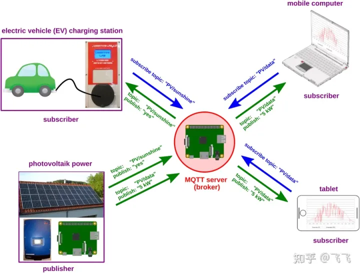
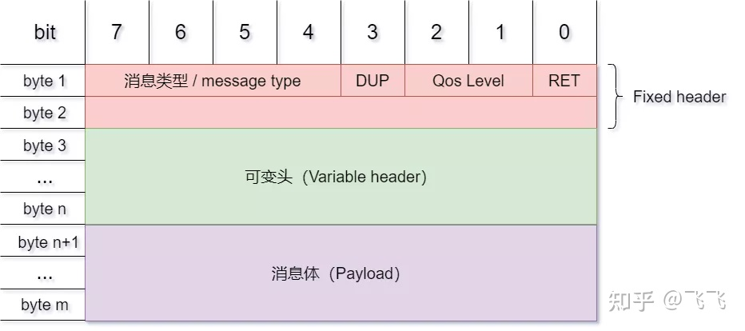
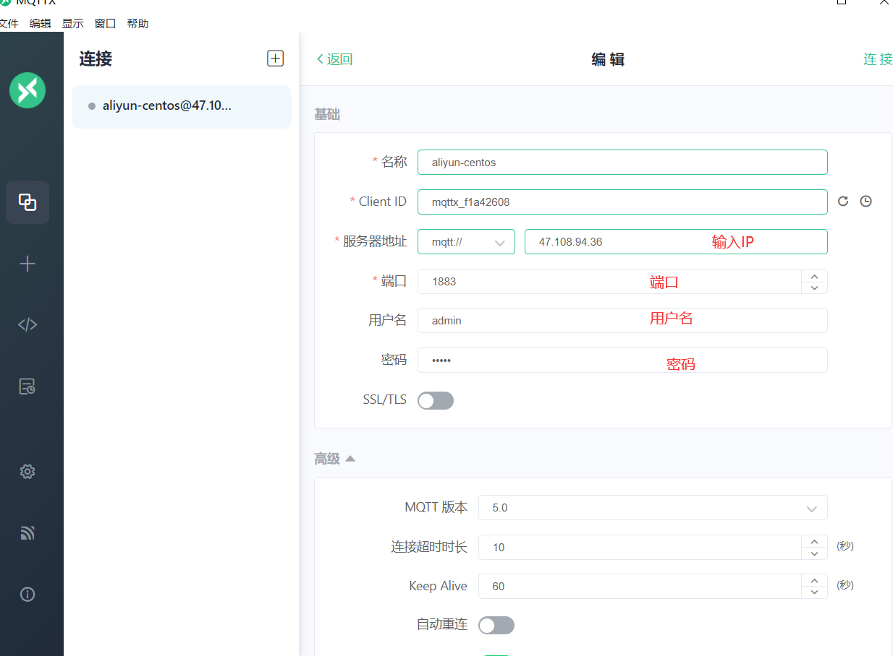
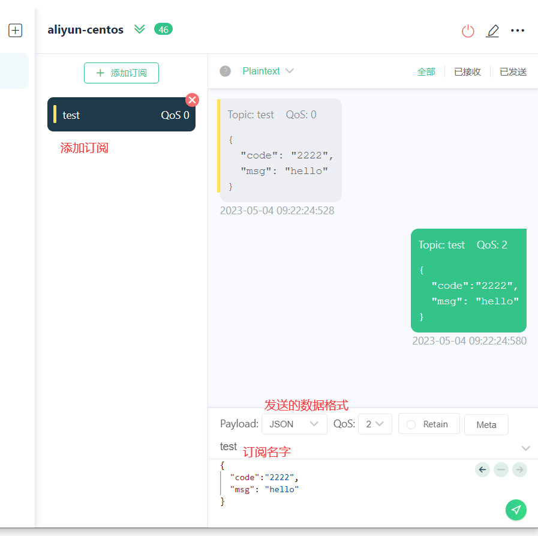
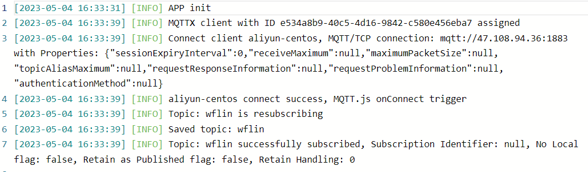

## mqtt

* 遥测传输协议，基于发布和订阅的轻量级通讯协议，构建在 tcp/ip 协议之上
* 标准版，简化版 （MQTT-SN）。

## 优点：

* 用极少代码和有限带宽，为远程设备提供实时可靠的消息服务。

* 开销低，带宽占用低。
* 基于 客户端-服务器。

## 工作模式：

* 提供一对多消息分发模式，实现应用程序解耦
* 消息传递模式，消息不是直接发送到接收点，而是由 mqtt-server（MQTT-Broke） 分发

## 场景



## QoS：

* QoS0: 会发送消息丢失或重复，消息发布依赖于底层TCP/IP网络。
* QoS1: 消息至少一次传送给订阅者
* QoS2：保证消息仅传送到目的地一次。为此，带有唯一消息 ID 的消息会存储两次，首先来自发送者，然后是接收者。QoS 级别 2 在网络中具有最高的开销，因为在发送方和接收方之间需要两个流。

## 数据包：

- `固定头（Fixed header）`，存在于所有`MQTT`数据包中，表示数据包类型及数据包的分组类标识；

- `可变头（Variable header）`，存在于部分`MQTT`数据包中，数据包类型决定了可变头是否存在及其具体内容；

- `消息体（Payload）`，存在于部分`MQTT`数据包中，表示客户端收到的具体内容；

  

## 平台

* ### Mosquitto

* ### EMQ X

* ### Eclipse

* ### HiveMQ

## 可视化工具

* mqtt-x

### 搭建：

#### 建立文件夹

* mkdir -p ./mosquitto/config
* mkdir -p ./mosquitto/data
* mkdir -p ./mosquitto/log

#### 目录设置权限

* chmod -R 755 ./mosquitto
* chmod -R 777 /mosquitto/log #日志目录要最大权限

#### 编辑配置文件

* vi /mosquitto/config/mosquitto.conf

  ```shell
  persistence true
  persistence_location /mosquitto/data
  log_dest file /mosquitto/log/mosquitto.log
  
  #监听端口默认是 9001，我的9001被占用所以我选择9002
  listener 9002
  ##通信端口
  port 1883
  ## 关闭匿名模式
  allow_anonymous false
  ## 指定密码文件
  password_file /mosquitto/config/pwfile.conf
  ```

#### 运行镜像

docker-compose.yaml

```shell
version: "3" 
services:
    mqtt:
        image: eclipse-mosquitto:2 
        container_name: mqtt
        privileged: true 
        ports: 
            - 1883:1883
            - 9002:9001
        volumes:
            - ./mosquitto/config:/mosquitto/config
            - ./mosquitto/data:/mosquitto/data
            - ./mosquitto/log:/mosquitto/log

```

#### 进入容器执行

* 创建密码管理文件

  touch /mosquitto/config/pwfile.conf

  chmod -R 755 /mosquitto/config/pwfile.conf

* 创建用户名和密码

  ```shell
  mosquitto_passwd -b /mosquitto/config/pwfile.conf admin admin
  ```

  `注意`：创建新用户之后都要重启容器重新加载配置文件，不然就会报没有认证


### 连接

* 

* 界面信息说明
* 

### 日志：

* 

## 开源框架

### SpringBoot 整合

* 博客：[https://blog.csdn.net/f4233441/article/details/121829743](https://blog.csdn.net/f4233441/article/details/121829743)

* pom

  ```xml
  
  <dependency>
      <groupId>org.springframework.integration</groupId>
      <artifactId>spring-integration-core</artifactId>
  </dependency>
  <dependency>
      <groupId>org.springframework.boot</groupId>
      <artifactId>spring-boot-starter-integration</artifactId>
  </dependency>
  <dependency>
      <groupId>org.springframework.integration</groupId>
      <artifactId>spring-integration-stream</artifactId>
  </dependency>
  <dependency>
      <groupId>org.springframework.integration</groupId>
      <artifactId>spring-integration-mqtt</artifactId>
  </dependency>
  ```

  

### 第三方

* Apollo

  太旧不推荐，

* Paho 

  ```xml
  <dependency>
    <groupId>org.eclipse.paho</groupId>
    <artifactId>org.eclipse.paho.client.mqttv3</artifactId>
    <version>1.2.2</version>
  </dependency>
  ```

* 场景：就和一般情况下我们是通过mybatis组件模拟发送sql请求,mqtt消息模拟,我们可以通过Eclipse Paho Java Client组件。

* 对了一遍节前布置的代码，虽然效果满足，但是抽象和单一原则，多线程，异步方面基本没考虑，程哥指正有一些代码习惯的问题，编码优化上给了很多宝贵的建议。
* 自己在代码编码方面。对于方法的定位有点混淆。方法基本没法复用。
* 这两天重构一版出来

## 代码实践

# 日报

### 引入pom

```xml
<dependency>
    <groupId>org.eclipse.paho</groupId>
    <artifactId>org.eclipse.paho.client.mqttv3</artifactId>
    <version>1.2.2</version>
</dependency>
```

### 代码

* 发布端

```java
package com.mqtt;

import org.eclipse.paho.client.mqttv3.MqttClient;
import org.eclipse.paho.client.mqttv3.MqttConnectOptions;
import org.eclipse.paho.client.mqttv3.MqttException;
import org.eclipse.paho.client.mqttv3.MqttMessage;
import org.eclipse.paho.client.mqttv3.persist.MemoryPersistence;

/**
 *发布端
 */
public class PublishSample {
    public static void main(String[] args) {

        String topic = "test2";
        String content = "hello mqtt";
        int qos = 1;
        String broker = "tcp://47.108.94.36:1883";
        String userName = "admin";
        String password = "admin";
        String clientId = "pubClient";
        // 内存存储
        MemoryPersistence persistence = new MemoryPersistence();

        try {
            // 创建客户端
            MqttClient sampleClient = new MqttClient(broker, clientId, persistence);
            // 创建链接参数
            MqttConnectOptions connOpts = new MqttConnectOptions();
            // 在重新启动和重新连接时记住状态
            connOpts.setCleanSession(false);
            // 设置连接的用户名
            connOpts.setUserName(userName);
            connOpts.setPassword(password.toCharArray());
            // 建立连接
            System.out.println("连接到 broker: " + broker);
            sampleClient.connect(connOpts);
            System.out.println("连接成功.");
            // 创建消息
            MqttMessage message = new MqttMessage(content.getBytes());
            // 设置消息的服务质量
            message.setQos(qos);
            // 发布消息
            System.out.println("向" + topic + "发送消息:" + message);
            sampleClient.publish(topic, message);
            // 断开连接
            sampleClient.disconnect();
            // 关闭客户端
            sampleClient.close();
        } catch (MqttException me) {
            System.out.println("reason " + me.getReasonCode());
            System.out.println("msg " + me.getMessage());
            System.out.println("loc " + me.getLocalizedMessage());
            System.out.println("cause " + me.getCause());
            System.out.println("excep " + me);
            me.printStackTrace();
        }
    }
}
```

* 订阅端

```java 
package com.mqtt;

import org.eclipse.paho.client.mqttv3.*;
import org.eclipse.paho.client.mqttv3.persist.MemoryPersistence;

/**
 *订阅端
 */
public class SubscribeSample {

    public static void main(String[] args) {
        //EMQ X 默认端口 1883
        String broker = "tcp://47.108.94.36:1883";
        String TOPIC = "test2";
        int qos = 1;
        String clientid = "subClient";
        String userName = "admin";
        String passWord = "admin";
        try {
            // host为主机名，test为clientid即连接MQTT的客户端ID，一般以客户端唯一标识符表示，MemoryPersistence设置clientid的保存形式，默认为以内存保存
            MqttClient client = new MqttClient(broker, clientid, new MemoryPersistence());
            // MQTT的连接设置
            MqttConnectOptions options = new MqttConnectOptions();
            // 设置是否清空session,这里如果设置为false表示服务器会保留客户端的连接记录，这里设置为true表示每次连接到服务器都以新的身份连接
            options.setCleanSession(true);
            // 设置连接的用户名
            options.setUserName(userName);
            // 设置连接的密码
            options.setPassword(passWord.toCharArray());
            // 设置超时时间 单位为秒
            options.setConnectionTimeout(10);
            // 设置会话心跳时间 单位为秒 服务器会每隔1.5*20秒的时间向客户端发送个消息判断客户端是否在线，但这个方法并没有重连的机制
            options.setKeepAliveInterval(20);
            // 设置回调函数
            client.setCallback(new MqttCallback() {

                public void connectionLost(Throwable cause) {
                    System.out.println("connectionLost");
                }

                public void messageArrived(String topic, MqttMessage message) {
                    System.out.println("======监听到来自[" + topic + "]的消息======");
                    System.out.println("message content:"+new String(message.getPayload()));
                    System.out.println("============");
                }

                public void deliveryComplete(IMqttDeliveryToken token) {
                    System.out.println("deliveryComplete---------"+ token.isComplete());
                }

            });

            // 建立连接
            System.out.println("连接到 broker: " + broker);
            client.connect(options);

            System.out.println("连接成功.");
            //订阅消息
            client.subscribe(TOPIC, qos);
            System.out.println("开始监听" + TOPIC);
        } catch (Exception e) {
            e.printStackTrace();
        }
    }
}
```

### 现象

* 订阅端

```txt
连接到 broker: tcp://47.108.94.36:1883
连接成功.
开始监听test2
======监听到来自[test2]的消息======
message content:hello mqtt
============
```

* 发布端

```txt
连接到 broker: tcp://47.108.94.36:1883
连接成功.
向test2发送消息:hello mqtt
```
