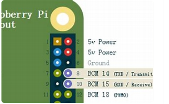

# 环境准备

额。。。 建议按照这个来(因为我就按照这个编译成功了)，因为最新镜像有时候要求你的 python 必须要 3.7 以上，所以编译的环境我推荐选用 ubuntu20

1. 安装镜像（ubuntu20） 略

2. 下载下面的命令下载软件

   > sudo apt-get update

   
   
   > sudo apt-get -y install build-essential asciidoc binutils bzip2 curl gawk gettext git libncurses5-dev libz-dev patch python3.5 python2.7 unzip zlib1g-dev lib32gcc1 libc6-dev-i386 subversion flex uglifyjs git-core gcc-multilib p7zip p7zip-full msmtp libssl-dev texinfo libglib2.0-dev xmlto qemu-utils upx libelf-dev autoconf automake libtool autopoint device-tree-compiler g++-multilib antlr3 gperf

# 编译

* 拉取源码(openwrt 的)【最好给 git 配置个魔法，因为GitHub有时候拉不到，而且后面也会去git一些东西】

* 源码拉取后更改目录权限为 可读可写可执行 (sudo chmod +x  openwrt 777)

* >./script/feeds update -a 

* > ./script/feeds install -a

* > make configmenu 【选择自己机型对应的配置】

* > make -j1 V=s 【第一次编译建议单线程编译成功率高】

编译大概会持续 4-5 小时，所以只有慢慢等

# 使用镜像

## usb 转 ttl 连接开发板

* 我的是树莓派，我用usb转串口进入的，也可以烧写进入之后连接网线和显示器的方式打开或者直接修改配置文件开启ssh ，使用 ssh 进入

