# 信号和槽

1. 信号：信号指控件发出的特定信号。

   比如按钮信号


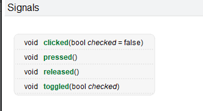


* 槽：就是槽函数的意思，我们可以把槽函数绑定在某一个控件信号上

# 关联信号和槽

## 自动关联

* 手动选择控件，然后右键 -> 转到槽

* 自动关联会给我们的工程添加以下内容

  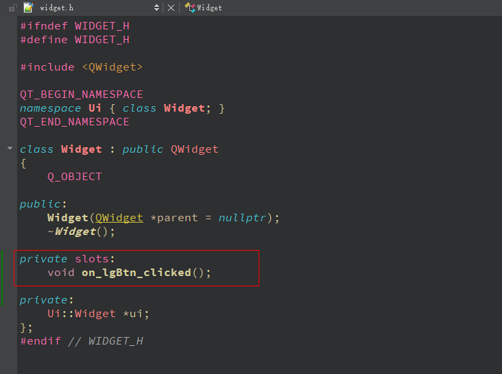

* 槽函数只能声明到 **private slot** 或者 **public slot**

  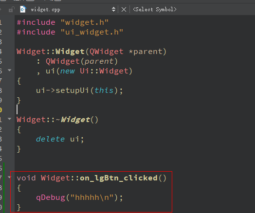

## 手动关联

* 使用 connect 函数

  ```c++
  connect(ui-> reBtn,SIGNAL(clicked()),this,SLOT(on_reBtn_clicked()));
  
  connect(A,SIGNAL(B),C,SLOT(D));
  #当对象 A 发出 B 信号的时候，就会触发对象 c 的槽函数 D
  ```

  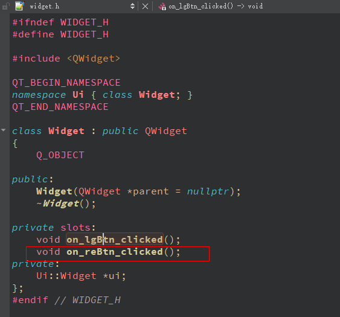

  ​	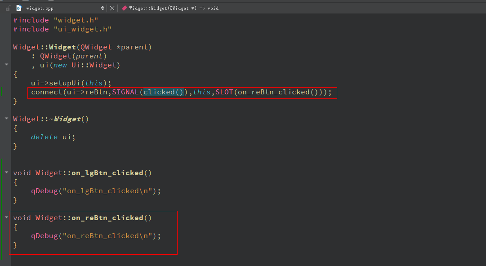

# 控件

## 添加图片

1. 添加 qt 资源文件

   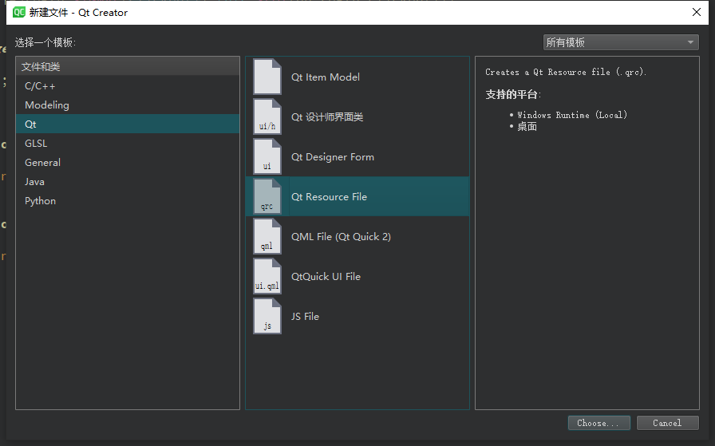

2. 添加资源文件 open with-> 资源编辑器

   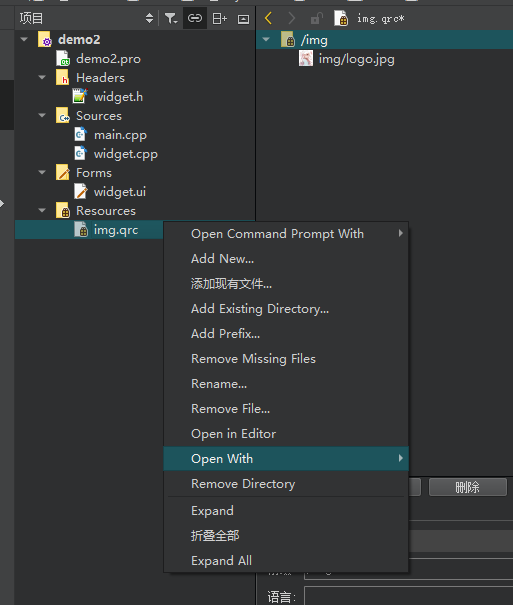

3. 添加前置路径

   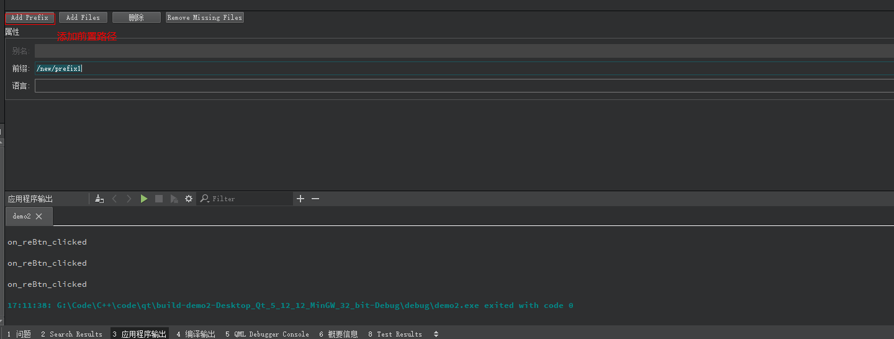

4. 点击添加文件选项，将要要的图片添加进去

   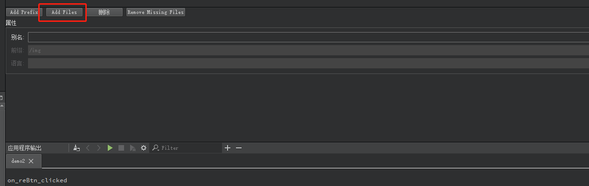

5. 添加 qlabel 控件，更改样式表

   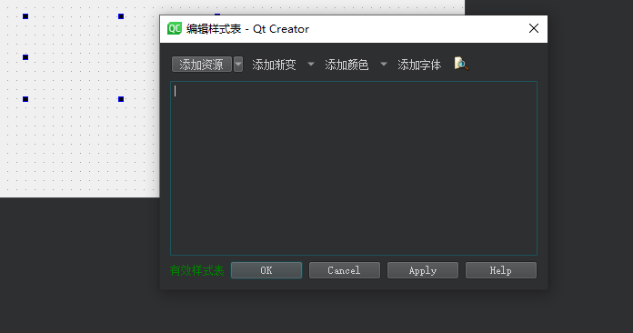

6. 添加资源 img（border-images）

   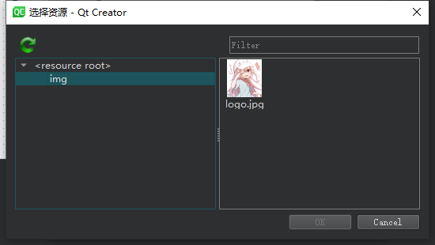

7. 效果

   * border-images

   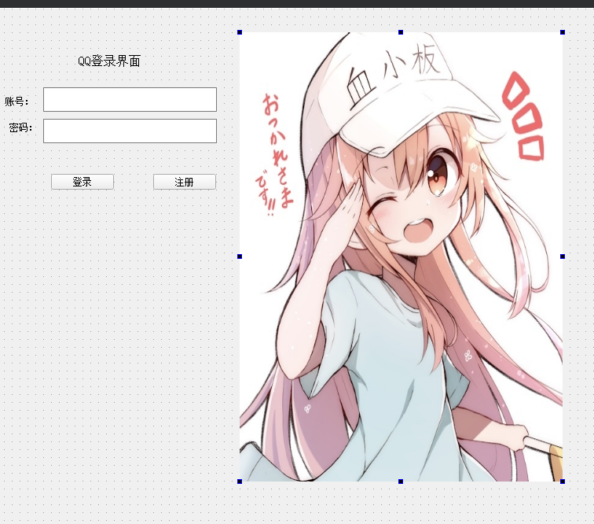

* background-images

  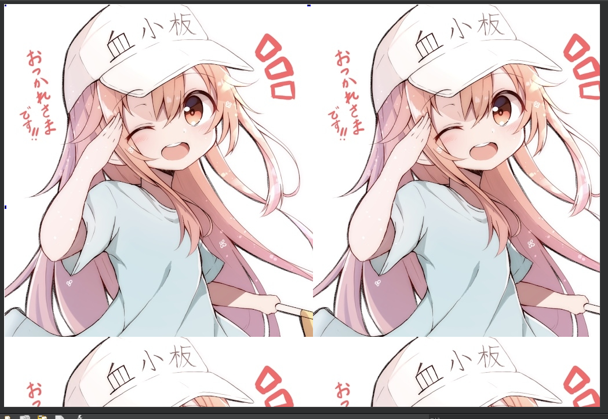

# 布局

## 水平布局

## 垂直布局

## 栅格化布局

# 界面切换

# qt下的串口编程

# qt网络编程

# qt下操作GPIO

