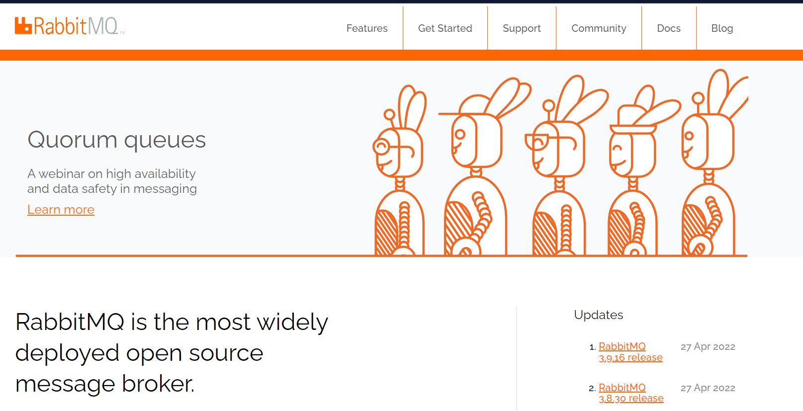

# RabbitMQ

## 1. MQ引言

### 1.1 什么是MQ

* MQ（Message Quene）:翻译为 `消息队列` ，通过典型的`生产者`和`消费者`模型 ,生产者不断向消息队列中产生消息，消费者不断从队列中获得消息。因为消息的产生和消费都是异步的，而且只关心消息的发送和接收，没用业务逻辑的侵入。轻松实现系统解耦。别名为`消息中间件` 通过利用高效可靠的消息传递机制进行平台无关的数据交流，并基于数据通信来进行分布式系统集成。

### 1.2 MQ 的种类

* 当今市面上有很多主流消息中间件，如老牌的 `ActiveMQ`,`RabbitMQ`,炙手可热的`KafKa`,阿里巴巴自主开发的 `RocketMQ`

### 1.3 不同 MQ 特点

```markdown
# 1. ActiveMQ
	ActiveMQ 是 apache 出品，最流行，能力强劲的开源数据总线。它是一个完全支持 JMS 规范的消息中间件，丰富的 API，多种集群架构模式让 ActiveMQ 在业界成为老牌消息中间件，中小企业很受欢迎
# 2. Kafka
	Kafka 是 LinkedIn 开源的分布式发布-订阅消息系统，目前归属于 apache 顶级项目。Kafka 的主要特点是基于 Pull 的来处理消息消费，追求高吞吐量，一开始的目的就是用于日志收集和传输，0.8 版本之后开始支持复制，不支持事务。对消息的重复，丢失，错误没有严格要求，适合产生大量数据的互联网服务的数据收集业务。
# 3. RocketMQ
	RocketMQ 是阿里开源的消息中间件，它是纯 Java 开发，具有高吞吐量，高可用性，适合大规模分布式系统应用的特点，RocketMQ 思路是起源于 Kafka，但并不是 Kafka 的一个 copy，它对于消息的可靠传输及事务性做了优化，目前在 阿里集团广泛被用于交易，充值，流计算，消息推送，日志流式处理，binglog 分发等场景
# 4. RabbitMQ
	RabbitMQ 是使用 Erlang 语言开发的开源消息队列系统，基于 AMQP 协议来实现。AMQP 的主要特点是面向消息，队列路由（包括点对点和发布订阅），可靠性，安全。AMQP 协议更多用在企业系统内对数据一致性，稳定性和可靠性要求很高的场景，对性能和吞吐量的要求还在其次。
```

>RabbitMQ 和 Kafka 可靠，Kafka 更适合高 IO 的处理，一般应用在大数据日志处理或对实时性（少量延迟），可靠性（少量丢数据）要求稍低的场景使用，比如 ELK 日志收集

## 2. RabbitMQ 引言

### 2.1 RabbitMQ

>基于 `AMOP` 协议，Erlang 语言开发，是部署最广泛的开源消息中间件，是最受欢迎的消息中间件之一。



`官网`：[[Messaging that just works — RabbitMQ](https://www.rabbitmq.com/)]([Messaging that just works — RabbitMQ](https://www.rabbitmq.com/))

`官方教程`：[[RabbitMQ Tutorials — RabbitMQ](https://www.rabbitmq.com/getstarted.html)]([RabbitMQ Tutorials — RabbitMQ](https://www.rabbitmq.com/getstarted.html))

```markdown
# AMQP 介绍
AMQP，即Advanced Message Queuing Protocol，高级消息队列协议，是应用层协议的一个开放标准，为面向消息的中间件设计。
	AMQP的主要特征是面向消息、队列、路由（包括点对点和发布/订阅）、可靠性、安全。
	AMQP在消息提供者和客户端的行为进行了强制规定，使得不同卖商之间真正实现了互操作能力。
	JMS是早期消息中间件进行标准化的一个尝试，它仅仅是在API级进行了规范，离创建互操作能力还差很远。
	与JMS不同，AMQP是一个Wire级的协议，它描述了在网络上传输的数据的格式，以字节为流。因此任何遵守此数据格式的工具，其创建和解释消息，都能与其他兼容工具进行互操作。
```

### 2.2 RabbitMQ 的作用

- **解耦**。如图所示。假设有系统B、C、D都需要系统A的数据，于是系统A调用三个方法发送数据到B、C、D。这时，系统D不需要了，那就需要在系统A把相关的代码删掉。假设这时有个新的系统E需要数据，这时系统A又要增加调用系统E的代码。为了降低这种强耦合，就可以使用MQ，**系统A只需要把数据发送到MQ，其他系统如果需要数据，则从MQ中获取即可**。

  

- **异步**。如图所示。一个客户端请求发送进来，系统A会调用系统B、C、D三个系统，同步请求的话，响应时间就是系统A、B、C、D的总和，也就是800ms。**如果使用MQ，系统A发送数据到MQ，然后就可以返回响应给客户端，不需要再等待系统B、C、D的响应，可以大大地提高性能**。对于一些非必要的业务，比如发送短信，发送邮件等等，就可以采用MQ。

  

- **削峰**。如图所示。这其实是MQ一个很重要的应用。假设系统A在某一段时间请求数暴增，有5000个请求发送过来，系统A这时就会发送5000条SQL进入MySQL进行执行，MySQL对于如此庞大的请求当然处理不过来，MySQL就会崩溃，导致系统瘫痪。**如果使用MQ，系统A不再是直接发送SQL到数据库，而是把数据发送到MQ，MQ短时间积压数据是可以接受的，然后由消费者每次拉取2000条进行处理，防止在请求峰值时期大量的请求直接发送到MySQL导致系统崩溃**。

  

## 3. RabbitMQ 特点

- 可靠性。支持持久化，传输确认，发布确认等保证了MQ的可靠性。
- 灵活的分发消息策略。这应该是RabbitMQ的一大特点。在消息进入MQ前由Exchange(交换机)进行路由消息。分发消息策略有：简单模式、工作队列模式、发布订阅模式、路由模式、通配符模式。
- 支持集群。多台RabbitMQ服务器可以组成一个集群，形成一个逻辑Broker。
- 多种协议。RabbitMQ支持多种消息队列协议，比如 STOMP、MQTT 等等。
- 支持多种语言客户端。RabbitMQ几乎支持所有常用编程语言，包括 Java、.NET、Ruby 等等。
- 可视化管理界面。RabbitMQ提供了一个易用的用户界面，使得用户可以监控和管理消息 Broker。
- 插件机制。RabbitMQ提供了许多插件，可以通过插件进行扩展，也可以编写自己的插件。

## 4. 安装 RabbitMQ 

* 我是用的 docker 安装

1. 拉取镜像

   >  docker pull rabbitmq:management

2. 查看镜像列表

   > docker images

3. 运行 MQ (简单版本)

   > docker run -d -p 5672:5672 -p 15672:15672 --name rabbitmq rabbitmq:management

4. 修改配置运行

   > docker run -d -p 15672:15672  -p  5672:5672  -e RABBITMQ_DEFAULT_USER=admin -e RABBITMQ_DEFAULT_PASS=admin --name rabbitmq rabbitmq:management
   >
   > > - -d 后台运行
   > > - -p 隐射端口
   > > - –name 指定rabbitMQ名称
   > > - RABBITMQ_DEFAULT_USER 指定用户账号
   > > - RABBITMQ_DEFAULT_PASS 指定账号密码

5. ```txt
   # latest RabbitMQ 3.9
   docker run -it --rm --name rabbitmq -p 5672:5672 -p 15672:15672 rabbitmq:3.9-management
   ```

## 5. java 连接 mq

### 5.1 加入 mq 依赖

```xml
<dependency>
    <groupId>com.rabbitmq</groupId>
    <artifactId>amqp-client</artifactId>
</dependency>
```

### 5.2 建立连接

```java
public class Provider {
    /**
     * 生产消息
     */
    @Test
    public void testSendMessagfe() throws IOException, TimeoutException {
        // 创建连接 mq 的工厂对象
        ConnectionFactory connectionFactory = new ConnectionFactory();
        // mq 的连接地址
        connectionFactory.setHost("192.168.96.137");
        // mq 连接的端口
        connectionFactory.setPort(5672);
        // 设置虚拟主机
        connectionFactory.setVirtualHost("/ems");
        // mq 连接用户名
        connectionFactory.setUsername("ems");
        // mq 连接的用户名密码
        connectionFactory.setPassword("123");
        // 建立连接获取连接对象
        Connection connection = connectionFactory.newConnection();
        // 获取连接中的通道
        Channel channel = connection.createChannel();
        // 一定记得关，我老忘
        channel.close();
        connection.close();
    }
}
```

### 5.3 向 mq 中发送消息

```java
@Slf4j
public class Provider {
    /**
     * 生产消息
     */
    @Test
    public void testSendMessagfe() throws IOException, TimeoutException {
        // 创建连接 mq 的工厂对象
        ConnectionFactory connectionFactory = new ConnectionFactory();
        // mq 的连接地址
        connectionFactory.setHost("192.168.96.137");
        // mq 连接的端口
        connectionFactory.setPort(5672);
        // 设置虚拟主机
        connectionFactory.setVirtualHost("/ems");
        // mq 连接用户名
        connectionFactory.setUsername("ems");
        // mq 连接的用户名密码
        connectionFactory.setPassword("123");
        // 建立连接获取连接对象
        Connection connection = connectionFactory.newConnection();
        // 获取连接中的通道
        Channel channel = connection.createChannel();
        /**
         * 通道绑定对应消息队列
         * 参数一：队列名称，如果队列不存在自动创建
         * 参数二：用来定义队列是否持久化 true 独占队列，false 不持久化
         * 参数三：execlusive 是否独占对队列，true 独占，false 不独占
         * 参数四：autoDelete 是否在消息完成后自动删除队列  true自动删除，false不自动删除
         */
        channel.queueDeclare("hello",false,false,false,null);
        // 发布消息
        /**
         * 参数 1 ：交换机名字，因为直连，没有交换机，所以没写
         * 参数 2 ：队列名称
         * 参数 3 ：传递消息的设置
         * 参数 4 ： 发送消息的内容（发送的是 byte类型的数组）
         */
        channel.basicPublish("","hello",null,"hello rabbitmq".getBytes());
         // 一定记得关，我老忘
        channel.close();
        connection.close();
    }
}
```

### 5.4 消费者从 mq 中取消息

```java
@Slf4j
public class Customer {
    public static void main(String[] args) throws IOException, TimeoutException {
        /**
         * 代码冗余了，所以后面会创建一个工具类
         */
        // 创建连接 mq 的工厂对象
        ConnectionFactory connectionFactory = new ConnectionFactory();
        // mq 的连接地址
        connectionFactory.setHost("192.168.96.137");
        // mq 连接的端口
        connectionFactory.setPort(5672);
        // 设置虚拟主机
        connectionFactory.setVirtualHost("/ems");
        // mq 连接用户名
        connectionFactory.setUsername("ems");
        // mq 连接的用户名密码
        connectionFactory.setPassword("123");
        // 建立连接获取连接对象
        Connection connection = connectionFactory.newConnection();
        // 获取通道
        Channel channel = connection.createChannel();
        // 绑定通道
        channel.queueDeclare("hello",false,false,false,null);
        // 消费消息
        // 参数一 ：消费那个队列的消息，队列名称
        // 参数二 ： 开启消息的自动确认机制
        // 参数三 ：消费消息时回调接口
        channel.basicConsume("hello",true, new DefaultConsumer(channel){
            /**
             * 参数说明：
             * @param consumerTag
             * @param envelope
             * @param properties
             * @param body 			消息的内容
             * @throws IOException
             */
            @Override
            public void handleDelivery(String consumerTag, Envelope envelope, AMQP.BasicProperties properties, byte[] body) throws IOException {
                System.out.println("new String(body)="+ new String(body));
            }
        });
        // 这俩一般不关闭，因为我们希望消费者一直监听我们的消息
        //channel.close();
        //connection.close();
    }

}
```

## 6. hello world 模型

* 选用上面的模型