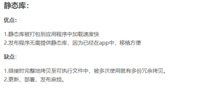

# 下载和烧写镜像

* 从官网下载树莓派镜像，使用烧写工具 balena-etcher 烧录镜像

## 串口登录

* 将系统烧写到 SD 卡后，重新拔插 SD 卡，连接到系统 usb，电脑会出现树莓派的 boot 分区

* 修改 config.txt 文件，将内容追加到文件末尾（停止了蓝牙，解除了对串口的占用）

  > dtoverlay=pi3-miniuart-bt

* 覆盖 cmdline.txt，万一失效，所以建议先把这个文件备份一份

  **原来的**

  > console=serial0,115200 console=tty1 root=PARTUUID=738a4d67-02 rootfstype=ext4 elevator=deadline fsck.repair=yes rootwait quiet init=/usr/lib/raspi-config/init_resize.sh

  **修改后**

  > dwc_otg.lpm_enable=0 console=tty1 console=serial0,115200 root=/dev/mmcblk0p2 rootfstype=ext4 elevator=deadline fsck.repair=yes rootwait

* 使用 USB-TTL转换模块如图连接线,TTL 的 TXD 连接到树莓派的 RXD，另一根也反向接线便可

  


* 线接好后插入电脑（电脑有安装了 USB 转串口驱动）在设备管理器看看使用的是哪个 COMS，使用终端工具选择串口和波特率进行连接便可

## SSH登录(我常用)

* 烧写好镜像后，一样把 SD 卡插入电脑，显示出 boot 分区

* 在boot目录添加两个文件

  * ssh（不要后缀，直接名字就叫 ssh，这样就可以开启 ssh）

  * 创建并添加一个文件 `wpa_supplicant.conf`

    ```txt
    ctrl_interface=DIR=/var/run/wpa_supplicant GROUP=netdev
    update_config=1
    country=CN
    
    network={
            ssid="无线网名称"
            psk="无线网密码"
    }
    ```

* 添加好两个文件后直接上电，在路由器的管理后台(或者 windows 直接开热点，连接Windows的热点)查看树莓派的IP

* 然后使用ssh 登录到树莓派

* 默认账户：pi

* 默认密码：raspberry

# 库编程


## 静态库

* **静态函数库**：是在程序执行前（编译）就加入到目标程序中去了 ；

* **优点**：运行快，发布程序无需提供静态库，因为已经在app中，移植方便

* **缺点**：编译生成的文件大

## 动态库

* **动态函数库**，是在程序执行时动态（临时）由目标程序去调用
* **缺点**： 运行慢
* **优点**： 小





## 生成库

### 静态库

* 静态库的生成：格式：xxxx.a 

  ```shell
  gcc calcufuncs.c -c 生成xxx.o文件
  
  ar rcs libcalcufunc.a calcufuncs.o xxx.o文件生成xxx.a静态库文件
  ```

### 动态库

* 动态库的生成：格式：xxxxx.so

  ```shell
  gcc -shared -fpic calcufuncs.c -o libcalc.so
  
  -shared 指定生成动态库
  -fpic 标准，fPIC 选项作用于编译阶段,在生成目标文件时就得使用该选项,以生成位置无关的代码。
  ```

## 库的使用

### 静态库

* ```shell
  gcc calculatorT.c -lcalcufunc -L ./ -o mainProStatic
  
  -lcalcufunc -l #是制定要用的动态库，库名砍头去尾
  -L #告诉gcc编译器从-L制定的路径去找静态库。默认是从/usr/lib  /usr/local/lib去找
  ```

* eg:

  > gcc calculatorT.c -lcalc -L ./ -o main libcalc.so

### 动态库

[推荐阅读博文]([linux动态库(.so)搜索路径(目录)设置方法 - zhangzheng08pku - 博客园 (cnblogs.com)](https://www.cnblogs.com/progamming/p/13043652.html))

* Linux动态库的默认搜索路径是/lib和/usr/lib。动态库被创建后，一般都复制到这两个目录中。当程序执行时需要某动态库，并且该动 态库还未加载到内存中，则系统会自动到这两个默认搜索路径中去查找相应的动态库文件，然后加载该文件到内存中，这样程序就可以使用该动态库中的函数，以及该动态库的其它资源了。在Linux 中，动态库的搜索路径除了默认的搜索路径外，还可以通过以下三种方法来指定。

  * 在配置文件/etc/ld.so.conf中指定动态库搜索路径；

    ```shell
    vi /etc/ld.so.conf #添加 lib目录（绝对路径）
    ldconfig
    ```

    

  * 通过环境变量LD_LIBRARY_PATH指定动态库搜索路径；

    ```shell
    export LD_LIBRARY_PATH=”LD_LIBRARY_PATH:libpath”
    ```

    

  * 在编译目标代码时指定该程序的动态库搜索路径。

    ```shell
    还可以在编译目标代码时指定程序的动态库搜索路径。通过gcc 的参数”-Wl,-rpath,”指定
    ```


# gpio

```txt
 +-----+-----+---------+------+---+---Pi 3B--+---+------+---------+-----+-----+
 | BCM | wPi |   Name  | Mode | V | Physical | V | Mode | Name    | wPi | BCM |
 +-----+-----+---------+------+---+----++----+---+------+---------+-----+-----+
 |     |     |    3.3v |      |   |  1 || 2  |   |      | 5v      |     |     |
 |   2 |   8 |   SDA.1 |   IN | 1 |  3 || 4  |   |      | 5v      |     |     |
 |   3 |   9 |   SCL.1 |   IN | 1 |  5 || 6  |   |      | 0v      |     |     |
 |   4 |   7 | GPIO. 7 |   IN | 1 |  7 || 8  | 1 | ALT0 | TxD     | 15  | 14  |
 |     |     |      0v |      |   |  9 || 10 | 1 | ALT0 | RxD     | 16  | 15  |
 |  17 |   0 | GPIO. 0 |   IN | 0 | 11 || 12 | 0 | IN   | GPIO. 1 | 1   | 18  |
 |  27 |   2 | GPIO. 2 |   IN | 0 | 13 || 14 |   |      | 0v      |     |     |
 |  22 |   3 | GPIO. 3 |   IN | 0 | 15 || 16 | 0 | IN   | GPIO. 4 | 4   | 23  |
 |     |     |    3.3v |      |   | 17 || 18 | 0 | IN   | GPIO. 5 | 5   | 24  |
 |  10 |  12 |    MOSI |   IN | 0 | 19 || 20 |   |      | 0v      |     |     |
 |   9 |  13 |    MISO |   IN | 0 | 21 || 22 | 0 | IN   | GPIO. 6 | 6   | 25  |
 |  11 |  14 |    SCLK |   IN | 0 | 23 || 24 | 1 | IN   | CE0     | 10  | 8   |
 |     |     |      0v |      |   | 25 || 26 | 1 | IN   | CE1     | 11  | 7   |
 |   0 |  30 |   SDA.0 |   IN | 1 | 27 || 28 | 1 | IN   | SCL.0   | 31  | 1   |
 |   5 |  21 | GPIO.21 |   IN | 1 | 29 || 30 |   |      | 0v      |     |     |
 |   6 |  22 | GPIO.22 |   IN | 1 | 31 || 32 | 0 | IN   | GPIO.26 | 26  | 12  |
 |  13 |  23 | GPIO.23 |   IN | 0 | 33 || 34 |   |      | 0v      |     |     |
 |  19 |  24 | GPIO.24 |   IN | 0 | 35 || 36 | 0 | IN   | GPIO.27 | 27  | 16  |
 |  26 |  25 | GPIO.25 |   IN | 0 | 37 || 38 | 0 | IN   | GPIO.28 | 28  | 20  |
 |     |     |      0v |      |   | 39 || 40 | 0 | IN   | GPIO.29 | 29  | 21  |
 +-----+-----+---------+------+---+----++----+---+------+---------+-----+-----+
 | BCM | wPi |   Name  | Mode | V | Physical | V | Mode | Name    | wPi | BCM |
 +-----+-----+---------+------+---+---Pi 3B--+---+------+---------+-----+-----+
```

# 交叉编译

## 环境配置

编译高版本的可以使用这个

https://developer.arm.com/tools-and-software/open-source-software/developer-tools/gnu-toolchain/gnu-a/downloads

交叉编译工具链

[https://github.com/raspberrypi/tools.git](https://github.com/raspberrypi/tools.git)

树莓派 linux 源码

[https://github.com/raspberrypi/linux.git](https://github.com/raspberrypi/linux.git)

### 临时配置

1. 打印系统环境变量

   > echo $PATH

2. 把 tools bin 追加到PATH

   > export PATH=$PATH:(toolsPATH)

3. shell 脚本

   ```shell
   #!/bin/bash
   DIR="$( cd "$( dirname "${BASH_SOURCE[0]}" )" && pwd )"
   export PATH="$PATH:$DIR/arm-bcm2708/gcc-linaro-arm-linux-gnueabihf-raspbian-x64/bin/"
   export ARCH=arm CROSS_COMPILE=arm-linux-gnueabihf- KERNEL=kernel7
   ```

   

   或者

   ```shell
   #!/bin/bash
   
   # 获取脚本所在目录的绝对路径
   SCRIPT_DIR=$(cd "$(dirname "$0")" && pwd)
   
   # 设置临时变量
   TEMP_VAR="$SCRIPT_DIR/tools/arm-bcm2708/arm-linux-gnueabihf/bin"
   
   # 将 TEMP_VAR 变量中的路径添加到 PATH 中
   export PATH="$TEMP_VAR:$PATH"
   
   export ARCH=arm CROSS_COMPILE=arm-linux-gnueabihf- KERNEL=kernel7
   
   # 输出变量值
   echo "New PATH: $PATH"
   ```

4. 使用

   > source env.sh

### 永久配置

则是将上面的shell 放到 profile 文件中

# 内核编译

[树莓派-内核开发-说明 下载代码 编译 替换内核_nicekwell的博客-CSDN博客](https://blog.csdn.net/nicekwell/article/details/78482833))

编译64位 [自己制作树莓派3B+ 64位系统（编译内核+rootfs制作）_自己复刻树莓派_请叫我雯子小姐的小爷的博客-CSDN博客](https://blog.csdn.net/m0_49475727/article/details/109247979)

### 安装的软件

```shell
sudo apt-get install bc -y
sudo apt-get install libncurses5-dev libncursesw5-dev -y
sudo apt-get install zlib1g:i386 -y
sudo apt-get install libc6-i386 lib32stdc++6 lib32gcc1 lib32ncurses5 -y
sudo apt install flex -y
sudo apt install bison -y
sudo apt-get install libelf-dev -y
sudo apt-get install lib32z1 -y
sudo apt-get install libgmp-dev -y
```

踩坑 

* `Unable to locate package zlib1g:i386`

解决

* sudo dpkg --add-architecture i386
* sudo apt-get update
* sudo apt-get install zlib1g:i386 -y

### 编译指令

* make ARCH=arm CROSS_COMPILE=arm-linux-gnueabihf- bcm2709_defconfig

#### 执行 menuconfig

```shell
ARCH=arm CROSS_COMPILE=arm-linux-gnueabihf- KERNEL=kernel7 make menuconfig
#指定arm架构  指定编译器                       树莓派            主要核心指令
```

#### 编译

```shell
ARCH=arm CROSS_COMPILE=arm-linux-gnueabihf- KERNEL=kernel7 make -j2 zImage modules dtbs >&1 | tee build.log
以n进程编译。不指明几进程的话则默认以单进程编译。
```

* zImage：生成内核镜像
* modules：生成驱动模块
* dtbs：配置文件

编译成功会生成 vmlinux 源码树目录，失败则无，编译成功后，目标 zimage 镜像 arch/arm/boot目录下，需要打包 zImage 成树莓派可用的 xxx.img

##### 踩坑

很明显编译不会那么顺利.......

* 错误：

```txt
error: #error New address family defined, please update secclass_map.
  246 | #error New address family defined, please update secclass_map.
```

* 解决办法：

[[PATCH\] selinux: use kernel linux/socket.h definitions for PF_MAX - Paulo Alcantara](https://lore.kernel.org/selinux/20190225005528.28371-1-paulo@paulo.ac/)

* 错误

```txt
No rule to make target 'debian/canonical-certs.pem', needed by 'certs/x509_certificate_list'.  Stop.
```

* 解决办法

[内核错误: No rule to make target ‘debian/canonical-certs.pem‘, needed by ‘certs/x509_certificate_list‘_no rule to make target 'debian/canonical-certs.pem_Imagine Miracle的博客-CSDN博客](https://blog.csdn.net/qq_36393978/article/details/118157426)


#### 打包 zimage 镜像

* 直接用linux源码包里的工具：

  > ./scripts/mkknlimg arch/arm/boot/zImage ./kernel_new.img

* 复制到内核

  > sudo cp kernel_new.img /home/ubuntu/raspberrypi/boot/kernel7.img

### 数据拷贝

* mkdir  boot data

#### 挂载sd卡

* mount /dev/sdb1 boot       一个 fat 分区，是 boot 相关的内容，kernel 的 img
* mount /dev/sdb2 data       一个是 ext4 分区，也就是系统的根目录分区

#### 安装 moudles 

* 设备驱动文件：hdmi，usb，wifi，io ......

  > sudo ARCH=arm CROSS_COMPILE=arm-linux-gnueabihf- KERNEL=kernel7 make INSTALL_MOD_PATH=(根目录)[ext4] modules_install
  
* 我的指令

  > sudo ARCH=arm CROSS_COMPILE=arm-linux-gnueabihf- KERNEL=kernel7 make INSTALL_MOD_PATH=/home/ubuntu/raspberrypi/data modules_install

### 更新 kernel.img 文件

备份原来的镜像

> cp kernel7.img kernel7.old.img

#### 方法一：

将新镜像复制到boot

>cp kernel_new.img boot/kernel.img

#### 方法二：

将新镜像复制到boot

> cp kernel_new.img boot/kernel8.img


编辑 boot/config.txt 文件，在最后加入一行：

> kernel=kernel_new.img 

### 复制其他相关文件

```shell
cp arch/arm/boot/dts/*.*dtb* [fat]/
cp arch/arm/boot/dts/overlays/*.dtb* [fat]/overlays/
cp arch/arm/boot/dts/overlays/README [fat]/overlays/
```

我的指令

```shell
sudo cp arch/arm/boot/dts/*.dtb /home/ubuntu/raspberrypi/boot/
sudo cp arch/arm/boot/dts/overlays/*.dtb* /home/ubuntu/raspberrypi/boot/overlays/
sudo cp arch/arm/boot/dts/overlays/README /home/ubuntu/raspberrypi/boot/overlays/
```


更新完成后插回树莓派即可开机，开机后可以用 uname -a 命令查看kernel信息已经改变

