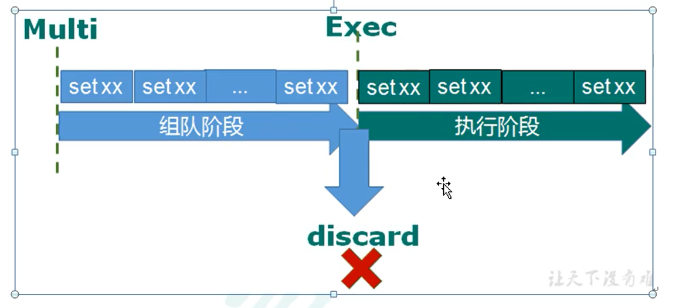
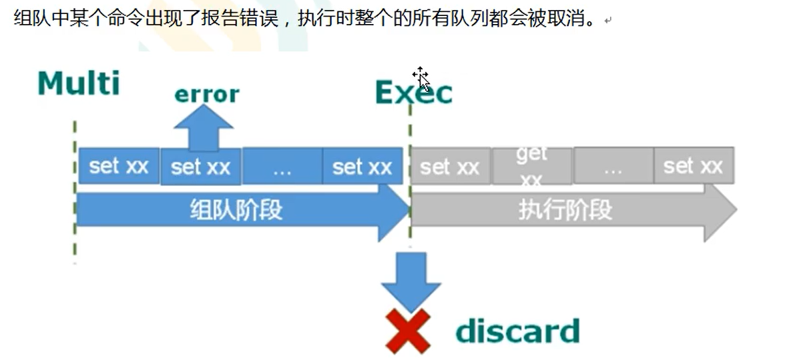
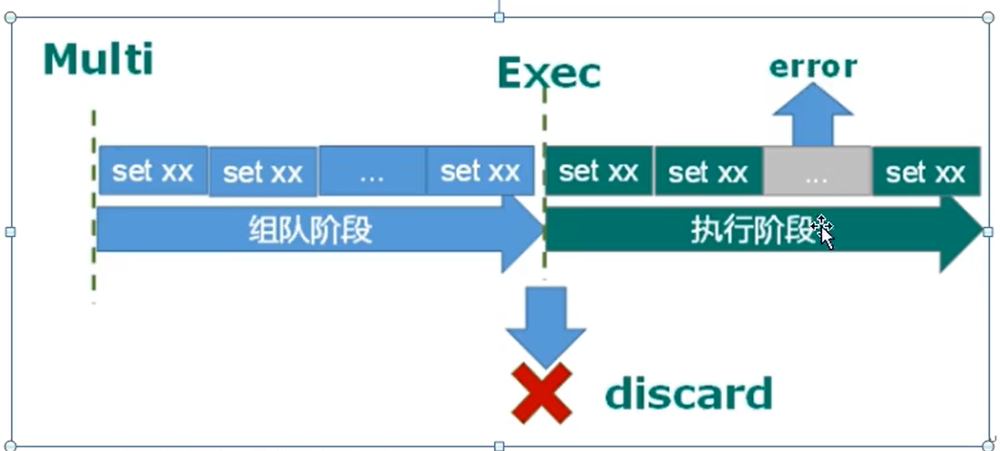
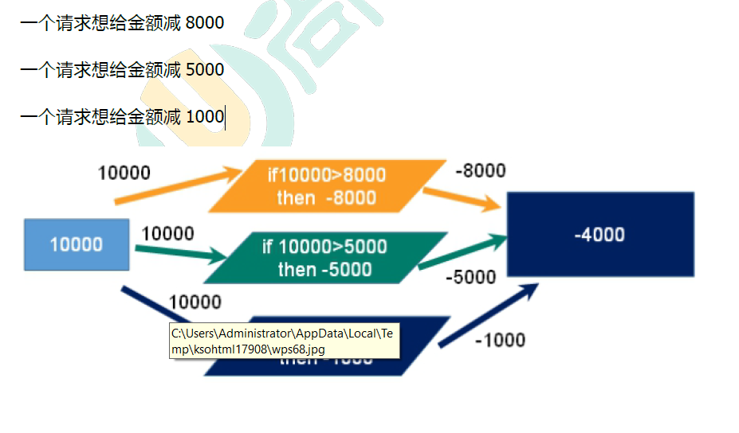
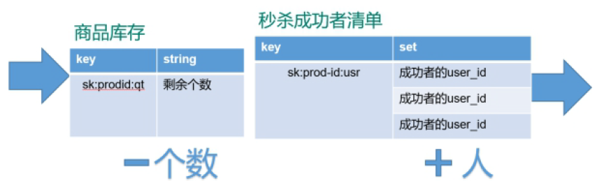
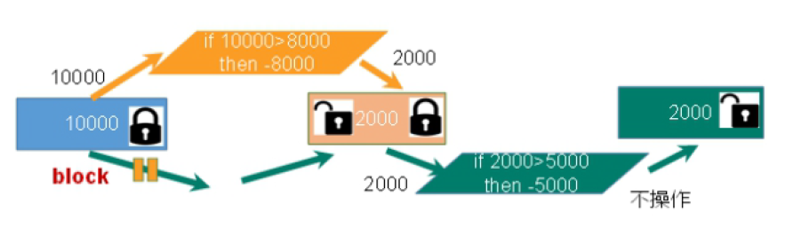
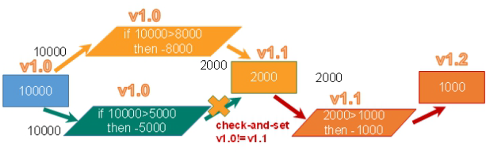
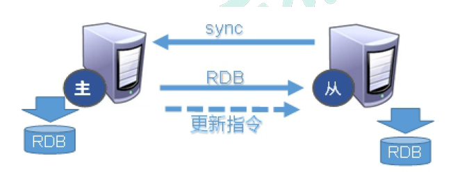
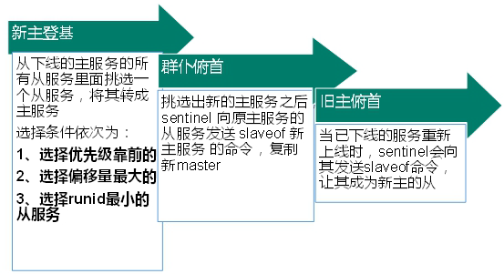

# redis


## 安装redis

1. 下载 redis 包

   [传送门](https://download.redis.io/releases/redis-6.2.6.tar.gz)

2. 安装

   * 解压：tar -xvf ./redis.tar.gz
   * 安装：make&make install

3. 启动 redis

   > 容器启动

   ```shell
   docker run -e "ACCEPT_EULA=Y" -e "SA_PASSWORD=@nba6666" \
      -p 1433:1433 --name sql1 --hostname sql1 \
      -d mcr.microsoft.com/mssql/server:2019-latest
      
   docker run --name oracle -d  registry.cn-hangzhou.aliyuncs.com/helowin/oracle_11g
   ```

   > 前台启动

   ```shell
   redis-server
   ```

   > 后台启动

   ```shell
   #先复制一份 redis。conf 文件到 /etc 配置目录下。
   cp /redis-6.2.6/redis.conf  /etc/redis.conf
   
   #然后打开 redis.conf 更改 daemonize 的值为 yes
   daemonize yes
   
   # 开始启动
   redis-server /etc/redis.conf #[redis 配置文件路径]
   ```

4. 连接 redis

   >redis-cli

   ​	redis 默认 16 【0-15】  张表，每张表的密码都是一样的。

5. redis 设置密码

   * 改配置文件的方式,开放 redis.conf 中的 requirepass passwd

   * 在 redis 中 通过命令改【个人推荐这么改，因为配置文件的改密码的位置不好找】

     > redis-cli  # 连接redis
     >
     > 127.0.0.1:6389 > config redis set requirepass passwd

## redis 键 (key)

1. **set key value**   设置键值对

2. **keys ***   查看当前库所有的 key

3. **exists key**   判断某个 key 是否存在 

4. **type key**  查看 key 的类型

5. **del key**  删除 key（立即删除） 

6. **unlink key**  根据 value 非阻塞删除

7. **expire key  second**   设置过期时间

8. **ttl key** 查看还有多少秒过期，

   * -1 表示永不过期

   * -2 表示已经过期

9. **select** 切换操作库  select number ( 0-15 )，默认是 0 号库，最多 15 号库

10. **dbsize** 查看当前数据库中 key 的数量

11. **flushdb**  清空当前库

12. **flushall** 通杀全部库

## redis 字符串（string）

* string 是redis 基础的数据类型之一，采用 key-value 的形式。是二进制安全的，也就是 redis 的 string  是可以包含任何数据数据的，比如 jpg png 图片 或者 序列化的对象。
* 一个 redis 中 string 的字符串 value 最多可以是 512M 

### 基本操作

1. **get**  <key> 查询对应键值

2. **set** <key> <value>  设置对应键值

   * 如果有相同的 key 被多次赋值，那么这个 key 对应的值只会是最后被赋予的值

3. **append** <key> <value> 追加到原来值的末尾

4. **strlen** <key> 计算 key 对应值的长

5. **setnx** <key> <value> 只要当 key 不存在时才设置 key 的值

6. **incr** <key>

   * 将 key 中存储的数字值增 1
   * 只能对数字值操作，如果为 空，新增值为 1
   * incrby <key> 20  key的值增加 20 

7. **decr** <key>

   * 将 key 中存储的数字值减 1
   * decrby <key> 20 key 的值减少 20

8. **mset** <key> <value> <key> <value>  ...... 

   * 可以同时设置一个或者多个 key-value 对

9. **mget**  <key> <value> <key> <value>  ......

   * 同时获取一个或者多个 value 

10. **msetnx** <key> <value> <key> <value> ......

    * 同时设置一个或者多个 key-value、只有当 所给定的 key 都不存在。原子性，有一个失败则都失败。

11. **getrange** <key> <起始位置> <结束位置>  获得值的范围，类似于 Java 中的 substring，前包，后包

12. **setrange** <key> <插入起始位置>  <内容>，覆盖内容，索引从 0 开始

    > 演示案例

    ```shell
    127.0.0.1:6379> set k1 "goof"
    OK
    127.0.0.1:6379> get k1
    "goof"
    127.0.0.1:6379> getrange k1 0 2
    "goo"
    127.0.0.1:6379> setrange k1 2 abc
    (integer) 5
    127.0.0.1:6379> get k1
    "goabc"
    127.0.0.1:6379> setrange k1 2 a
    (integer) 5
    127.0.0.1:6379> get k1
    "goabc"
    127.0.0.1:6379> setrange k1 3 a
    (integer) 5
    127.0.0.1:6379> get k1
    "goaac"
    ```

13. **setex** <key> <过期时间> <value> 设置键值的时候，设置过期时间，单位为 秒。

14. **getset** <key> <value> 以新值换旧值，设置新值的同时获取旧值

    > 演示案例

    ```shell
    127.0.0.1:6379> set k1 good
    OK
    127.0.0.1:6379> get k1
    "good"
    127.0.0.1:6379> getset k1 java
    "good"
    127.0.0.1:6379> get k1
    "java"
    ```

## redis 列表( list )

* 单键多值，可以从头或者尾加，底层为双向循环链表结构，所以两端的操作性很高，通过索引下标操作中间节点的性能会较差。

### 基本操作

1. l**push/rpush** <key> <value1> <value2> <value3> ...... 

   * 从左边或者右边插入多个值
   * 值在键在，值亡键亡

2. **lrange** <key> 0 -1 遍历全部

   > 演示案例

   ```shell
   [root@192 etc]# flushdb
   -bash: flushdb: 未找到命令
   [root@192 etc]# cd
   [root@192 ~]# redis-cli 
   127.0.0.1:6379> flushdb
   OK
   127.0.0.1:6379> lpush k1 20 v1 v2 v3
   (integer) 4
   127.0.0.1:6379> lrange k1 0 -1
   1) "v3"
   2) "v2"
   3) "v1"
   4) "20"
   127.0.0.1:6379> 
   ```

   **注意**

   * 从左边放，就是栈结构 先进后出
   * 从右边放，就是 正常顺序

3. **lpop/rpop** <key> 从左边 / 右边吐出一个值。值在键在，值光键亡

   > 演示案例

   ```shell
   127.0.0.1:6379> lpop k1 
   "v3"
   127.0.0.1:6379> lrange k1 0 -1
   1) "v2"
   2) "v1"
   3) "20"
   127.0.0.1:6379> rpop k1 
   "20"
   127.0.0.1:6379> lrange k1 0 -1
   1) "v2"
   2) "v1"
   
   # 当 key 里没值了
   127.0.0.1:6379> rpop k1 
   "v2"
   127.0.0.1:6379> rpop k1 
   (nil)
   127.0.0.1:6379> 
   ```

   

4. **rpoplpush** <key1> <key2> 从 key1 列表右边吐出一个值，插到 key2 列表左边。

   > 演示案例

   ```shell
   127.0.0.1:6379> lrange k1 0 -1
   1) "20"
   2) "v1"
   3) "v2"
   4) "v3"
   127.0.0.1:6379> lrange k2 0 -1
   1) "v3"
   2) "v2"
   3) "v1"
   4) "20"
   127.0.0.1:6379> rpoplpush k1 k2
   "v3"
   127.0.0.1:6379> lrange k1 0 -1
   1) "20"
   2) "v1"
   3) "v2"
   127.0.0.1:6379> lrange k2 0 -1
   1) "v3"
   2) "v3"
   3) "v2"
   4) "v1"
   ```

5. **lrange** <key> <start> <stop> 按照索引下标获得元素（从左到右）

   * 类似 python 语言的 切片语法

   > 演示案例

   ```shell
   127.0.0.1:6379> lrange k1 0 3
   1) "20"
   2) "v1"
   3) "v2"
   127.0.0.1:6379>
   127.0.0.1:6379> lrange k1 -4 -1
   1) "20"
   2) "v1"
   3) "v2"
   127.0.0.1:6379> 
   ```

6. **lindex** <key> <index> 按照索引下标获取元素（从左到右）

7. **llen** <key> 获取列表的长度

8. **linsert** <key> **before/after** <value> <newvalue> 在 <value> 的前面 / 后面插入 <newvalue> 插入值

   > 演示案例

   ```shell
   # after
   127.0.0.1:6379> linsert k1 after 20  kk
   (integer) 4
   127.0.0.1:6379> lrange k1 0 -1
   1) "20"
   2) "kk"
   3) "v1"
   4) "v2"
   127.0.0.1:6379> 
   
   # before 
   127.0.0.1:6379> linsert k1 before 20  jj
   (integer) 5
   127.0.0.1:6379> lrange k1 0 -1
   1) "jj"
   2) "20"
   3) "kk"
   4) "v1"
   5) "v2"
   127.0.0.1:6379> 
   ```

9. **lrem** <key> <n> <value> 从左边删除 n 个 value

10. **lset** <key> <index> <value> 将列表 key 下标为 index 的值替换成 value

## redis 集合（set）

## redis 哈希（Hash）

## redis 有序集合 （Zset）

## 配置文件介绍

## redis 的发布和订阅

## redis6 新数据类型

## spring or web 整合 redis6

### 加入 Maven 依赖

````xml
 <dependencies>

        <!--redis 的依赖包-->
        <dependency>
            <groupId>redis.clients</groupId>
            <artifactId>jedis</artifactId>
            <version>3.2.0</version>
        </dependency>

        <!--测试-->
        <dependency>
            <groupId>junit</groupId>
            <artifactId>junit</artifactId>
            <version>4.13.2</version>
            <scope>compile</scope>
        </dependency>
    </dependencies>
````

### 连接并测试源码程序

* `JedisDemo1.java`

```java
import org.junit.Test;
import redis.clients.jedis.Jedis;

import java.util.List;
import java.util.Set;

public class JedisDemo1 {
    public static void main(String[] args) {
        //创建 Jedis 对象
        Jedis jedis = new Jedis("127.0.0.1", 6379);
        //测试是否可以连接上
        String ping = jedis.ping();
        System.out.println(ping);
        jedis.close();
    }

    // 单元测试，操作 key
    @Test
    public void demo1() {
        //创建 Jedis 对象
        Jedis jedis = new Jedis("wflin-Nas.local", 6379);

        // 向 redis 里面添加
        jedis.set("name", "lucy");

        // 向 redis 里面获取东西
        String name = jedis.get("name");
        System.out.println(name);

        // 设置多个 key-value
        jedis.flushDB();
        jedis.mset("k1", "v1", "k2", "v2", "k3", "v3");
        List<String> values = jedis.mget("k1", "k2", "k3");
        System.out.println(values);

        Set<String> keys = jedis.keys("*");
        for (String key : keys) {
            System.out.println(key);
        }
        jedis.close();
    }
} 
```


### 小案例 redis 模拟手机验证码发送

* `PhoneCode.java`

  ```java
  import redis.clients.jedis.Jedis;
  
  import java.util.Random;
  
  /**
   * 1. 输入手机号，点击发送后随机生成 6 位数字码，2 min有效
   * 2. 输入验证码，点击验证，返回成功或者失败
   * 3. 每个手机号每天只能输入3次
   */
  
  public class PhoneCode {
      public static void main(String[] args) {
          // 这俩方法分开运行,好看效果
          // 模拟验证码的发送
          verifyCode("1111111");
  
          // 进行消息验证
          getRedisCode("1111111","998810");
  
      }
  
      // 3. 验证码的校验
      public static void getRedisCode(String phone, String code) {
          //链接 redis
          Jedis jedis = new Jedis("wflin-Nas.local", 6379);
          String codeKey = "VerifyCode" + phone + "code";
          // 得到验证码
          String redisCode = jedis.get(codeKey);
          // 做判断
          if (redisCode.equals(code)) {
              System.out.println("成功");
          } else {
              System.out.println("失败");
          }
          jedis.close();
      }
  
      // 2.每个手机每天只能发送三次,验证码放到 redis 中,设置过期时间
      public static void verifyCode(String phone) {
          //链接 redis
          Jedis jedis = new Jedis("wflin-Nas.local", 6379);
  
          // 拼接 key
          // 手机发送次数 key
          String countKey = "VerifyCode" + phone + "count";
          // 验证码 key
          String codeKey = "VerifyCode" + phone + "code";
  
          // 每个手机,每天只能发送三次
          String count = jedis.get(countKey);
          if (count == null) {
              // 没有发送次数
              // 设置发送次数是 1
              jedis.setex(countKey, 24 * 60 * 60, "1");
          } else if (Integer.parseInt(count) <= 2) {
              // 发送次数+1
              jedis.incr(countKey);
          } else if (Integer.parseInt(count) > 2) {
              System.out.println("今天发送次数已经超过了3次");
              return;
          }
          // 把 key 和 value 放到 redis 里面
          String vcode = getCode();
          // 不切换换窗口,测试方便,直接打印
          System.out.println("生成的验证码:"+vcode);
          jedis.setex(codeKey, 120, vcode);
          jedis.close();
  
      }
  
      // 生成 6 位数验证码
      static public String getCode() {
          Random random = new Random();
          String code = "";
          for (int i = 0; i < 6; i++) {
              code += random.nextInt(10);
          }
          return code;
      }
  }
  ```

## springboot 整合 redis6

### 加入 Maven 依赖

```xml
    <dependencies>
        <!-- springboot starter -->
        <dependency>
            <groupId>org.springframework.boot</groupId>
            <artifactId>spring-boot-starter-web</artifactId>
        </dependency>

        <dependency>
            <groupId>org.springframework.boot</groupId>
            <artifactId>spring-boot-starter-test</artifactId>
            <scope>test</scope>
        </dependency>

        <!-- redis starter-->
        <dependency>
            <groupId>org.springframework.boot</groupId>
            <artifactId>spring-boot-starter-data-redis</artifactId>
        </dependency>

        <!-- spring2.X集成redis所需common-pool2-->
        <dependency>
            <groupId>org.apache.commons</groupId>
            <artifactId>commons-pool2</artifactId>
            <version>2.6.0</version>
        </dependency>
    </dependencies>
```

### redis6 配置类

### springboot 配置文件配置redis6

* `application.properties`

  ```properties
  #Redis服务器地址
  spring.redis.host='wflin-Nas.local'
  #Redis服务器连接端口
  spring.redis.port=6379
  #Redis数据库索引（默认为0）
  spring.redis.database= 0
  #连接超时时间（毫秒）
  spring.redis.timeout=1800000
  #连接池最大连接数（使用负值表示没有限制）
  spring.redis.lettuce.pool.max-active=20
  #最大阻塞等待时间(负数表示没限制)
  spring.redis.lettuce.pool.max-wait=-1
  #连接池中的最大空闲连接
  spring.redis.lettuce.pool.max-idle=5
  #连接池中的最小空闲连接
  spring.redis.lettuce.pool.min-idle=0
  ```

  或者

* `application.yaml`

  ```yaml
  spring:
    redis:
  	# redis IP
  	host: "wflin-Nas.local"
      port: 6389
      database: 0
      connect-timeout: 1800000
      lettuce:
        # 连接池设置
        pool:
          max-active: 20
          max-wait: -1
          max-idle: 5
          min-idle: 0
  ```

* `RedisConfig.java`

  ```java
  package com.redis.config;
  import com.fasterxml.jackson.annotation.JsonAutoDetect;
  import com.fasterxml.jackson.annotation.PropertyAccessor;
  import com.fasterxml.jackson.databind.ObjectMapper;
  import org.springframework.cache.CacheManager;
  import org.springframework.cache.annotation.CachingConfigurerSupport;
  import org.springframework.cache.annotation.EnableCaching;
  import org.springframework.context.annotation.Bean;
  import org.springframework.context.annotation.Configuration;
  import org.springframework.data.redis.cache.RedisCacheConfiguration;
  import org.springframework.data.redis.cache.RedisCacheManager;
  import org.springframework.data.redis.connection.RedisConnectionFactory;
  import org.springframework.data.redis.core.RedisTemplate;
  import org.springframework.data.redis.serializer.Jackson2JsonRedisSerializer;
  import org.springframework.data.redis.serializer.RedisSerializationContext;
  import org.springframework.data.redis.serializer.RedisSerializer;
  import org.springframework.data.redis.serializer.StringRedisSerializer;
  
  import java.time.Duration;
  
  @EnableCaching
  @Configuration
  public class RedisConfig extends CachingConfigurerSupport {
  
      @Bean
      public RedisTemplate<String, Object> redisTemplate(RedisConnectionFactory factory) {
          RedisTemplate<String, Object> template = new RedisTemplate<>();
          RedisSerializer<String> redisSerializer = new StringRedisSerializer();
          Jackson2JsonRedisSerializer jackson2JsonRedisSerializer = new Jackson2JsonRedisSerializer(Object.class);
          ObjectMapper om = new ObjectMapper();
          om.setVisibility(PropertyAccessor.ALL, JsonAutoDetect.Visibility.ANY);
          om.enableDefaultTyping(ObjectMapper.DefaultTyping.NON_FINAL);
          jackson2JsonRedisSerializer.setObjectMapper(om);
          template.setConnectionFactory(factory);
  //key序列化方式
          template.setKeySerializer(redisSerializer);
  //value序列化
          template.setValueSerializer(jackson2JsonRedisSerializer);
  //value hashmap序列化
          template.setHashValueSerializer(jackson2JsonRedisSerializer);
          return template;
      }
  
      @Bean
      public CacheManager cacheManager(RedisConnectionFactory factory) {
          RedisSerializer<String> redisSerializer = new StringRedisSerializer();
          Jackson2JsonRedisSerializer jackson2JsonRedisSerializer = new Jackson2JsonRedisSerializer(Object.class);
  //解决查询缓存转换异常的问题
          ObjectMapper om = new ObjectMapper();
          om.setVisibility(PropertyAccessor.ALL, JsonAutoDetect.Visibility.ANY);
          om.enableDefaultTyping(ObjectMapper.DefaultTyping.NON_FINAL);
          jackson2JsonRedisSerializer.setObjectMapper(om);
  // 配置序列化（解决乱码的问题）,过期时间600秒
          RedisCacheConfiguration config = RedisCacheConfiguration.defaultCacheConfig()
                  .entryTtl(Duration.ofSeconds(600))
                  .serializeKeysWith(RedisSerializationContext.SerializationPair.fromSerializer(redisSerializer))
                  .serializeValuesWith(RedisSerializationContext.SerializationPair.fromSerializer(jackson2JsonRedisSerializer))
                  .disableCachingNullValues();
          RedisCacheManager cacheManager = RedisCacheManager.builder(factory)
                  .cacheDefaults(config)
                  .build();
          return cacheManager;
      }
  }
  ```

* `RedisTestController.java`，连接测试类

  ```java
  import org.springframework.beans.factory.annotation.Autowired;
  import org.springframework.data.redis.core.RedisTemplate;
  import org.springframework.web.bind.annotation.GetMapping;
  import org.springframework.web.bind.annotation.RequestMapping;
  import org.springframework.web.bind.annotation.RestController;
  
  @RestController
  @RequestMapping("/")
  public class RedisTestController {
  
      @Autowired
      private RedisTemplate redisTemplate;
  
      @GetMapping
      public String testRedis() {
          //设置值到redis
          redisTemplate.opsForValue().set("name", "lucy");
          //从redis获取值
          String name = (String) redisTemplate.opsForValue().get("name");
          return name;
      }
  }
  ```

* 访问 http:127.0.0.1:8080 可以访问到 lucy


## redis 事务

* `Redis事务`是一个单独的隔离操作：`事务中的所有命令都会序列化`、按`顺序地执行`。事务在执行的过程中，不会被其他客户端发送来的命令请求所打断。
* Redis事务的主要作用就是`串联多个命令防止别的命令插队`。

### 事务成功



#### Multi

* 创建一个队列 Queen
  * 类似 MySQL 中的开启事务（translate）

#### Exec

* 提交队列
  * 类似 MySQL 中的提交事务（commit），代表事务结束

#### discard

* 取消队列
  * 类似 MySQL中的回滚（rollback）

```shell
127.0.0.1:6379> MULTI
OK
127.0.0.1:6379(TX)> set k1 v1
QUEUED
127.0.0.1:6379(TX)> set k12 v2
QUEUED
127.0.0.1:6379(TX)> exec
1) OK
2) OK
127.0.0.1:6379> 
127.0.0.1:6379> MULTI
OK
127.0.0.1:6379(TX)> set a1 v1
QUEUED
127.0.0.1:6379(TX)> set a2 v2
QUEUED
127.0.0.1:6379(TX)> DISCARD
OK
127.0.0.1:6379> 
```

### 事务失败

#### 组队中出错

* `组队中某个命令出现报告错误，执行时整个的所有队列都会被取消`

  

* 事例演示

  ```shell
  127.0.0.1:6379> multi
  OK
  127.0.0.1:6379(TX)> set k1 v1
  QUEUED
  127.0.0.1:6379(TX)> set k2 v2
  QUEUED
  127.0.0.1:6379(TX)> set k3
  (error) ERR wrong number of arguments for 'set' command
  127.0.0.1:6379(TX)> exec
  (error) EXECABORT Transaction discarded because of previous errors.
  127.0.0.1:6379> 
  ```


#### 执行时出错

* `如果执行阶段某个命令报出了错误，则只有报错的命令不会被执行，而其他的命令都会执行，不会回滚`

  

* 实例演示

  ```shell
  127.0.0.1:6379> multi
  OK
  127.0.0.1:6379(TX)> set k1 v1
  QUEUED
  127.0.0.1:6379(TX)> set k2 v2
  QUEUED
  127.0.0.1:6379(TX)> INCR k3
  QUEUED
  127.0.0.1:6379(TX)> set k4 v4
  QUEUED
  127.0.0.1:6379(TX)> exec
  1) OK
  2) OK
  3) (integer) 1
  4) OK 
  ```
  

### 为什么要做成事务

* 有很多人有你的账户,同时去参加双十一抢购

### 事务冲突的问题

* 事例子：



## Redis_事务_秒杀案例

### 1、解决计数器和人员记录的事务操作



### 2、Redis事务--秒杀并发模拟

### jedis秒杀实例

> 待整理

### RedisTemplate 秒杀实例

[RedisTemplate](seckill.html ':include')

## 锁

#### 悲观	锁：(Pessimistic Lock)

* 顾名思义，就是很悲观，`每次去拿数据的时候都认为别人会修改`，所以`每次在拿数据的时候都会上锁`，这样`别人想拿这个数据就会block直到它拿到锁`。传统的关系型数据库里边就用到了很多这种锁机制，比如`行锁，表锁等，读锁，写锁`等，都是在做操作之前先上锁。

  

#### 乐观锁 (Optimistic Lock)

* 顾名思义，就是很乐观，`每次去拿数据的时候都认为别人不会修改`，所以`不会上锁`，但是`在更新的时候会判断`一下在此期间别人有没有去更新这个数据，可以`使用版本号等机制`。`乐观锁适用于多读的应用类型`，这样可以提高吞吐量。`Redis就是利用这种check-and-set机制实现事务的`。(MybatisPlus 事务机制很像)

  

#### watch and unwatch

* watch 

  * 在`执行multi之前`，先执行`watch key1 [key2]`,可以`监视`一个(或多个) key ，`如果在事务执行之前这个(或这些) key 被其他命令所改动，`那么`事务将被打断`。

* unwatch

  * `取消 WATCH 命令对所有 key 的监视`。如果在执行WATCH 命令之后，`EXEC 命令或DISCARD 命令先被执行了的话`，那么就`不需要再执行UNWATCH` 了。

* 举例子

  ```txt
  127.0.0.1:6379> set ban 100
  OK
  127.0.0.1:6379> watch ban
  OK
  127.0.0.1:6379> MULTI
  OK
  127.0.0.1:6379(TX)> incrby ban 10
  QUEUED
  127.0.0.1:6379(TX)> decrby ban 20
  QUEUED
  127.0.0.1:6379(TX)> exec
  1) (integer) 110
  2) (integer) 90
  127.0.0.1:6379> 
  127.0.0.1:6379> get ban
  "90"
  127.0.0.1:6379> 
  ```

### redis 事务的特性

* 单独的隔离操作
  * 事务中的所有命令都会序列化、按顺序地执行。事务在执行的过程中，不会被其他客户端发送来的命令请求所打断。
* 没有隔离级别的概念
  * 队列中的命令没有提交之前都不会实际被执行，因为事务提交前任何指令都不会被实际执行
* 不保证原子性
  * 事务中如果有一条命令执行失败，其后的命令仍然会被执行，没有回滚

## Redis 通过 mybatis 做二级缓存

### 开启 mybatis 的二级缓存

```xml
<?xml version="1.0" encoding="UTF-8" ?>
<!DOCTYPE mapper
        PUBLIC "-//mybatis.org//DTD Mapper 3.0//EN"
        "http://mybatis.org/dtd/mybatis-3-mapper.dtd">

<mapper namespace="rediscache.dao.UserMapper">
    
    <!--开启mybatis的二级缓存-->
    <!-- type 是缓存的设置位置 -->
    <cache type="rediscache.cache.RedisCache"/>
    
</mapper>
```

### 创建 ApplicationContextUtils 工具类获取 redisTemplate 对象

* 

```java
@Configuration
public class ApplicationContextUtils implements ApplicationContextAware {

    private static ApplicationContext applicationContext;

    @Override
    public void setApplicationContext(ApplicationContext applicationContex) throws BeansException {
        applicationContext = applicationContex;
    }
    public static Object getBean(String beanName){
        return applicationContext.getBean(beanName);
    }
}

```


### 创建 Redis cache 类并继承 mybatisCache 重写里面的方法

```java
public class RedisCache implements Cache {

    private final String id;

    public RedisCache(String id){
        System.out.println(id);
        this.id = id;
    }

    @Override
    public ReadWriteLock getReadWriteLock() {
        return null;
    }

    @Override
    public String getId() {
        return this.id;
    }

    // 放缓存,最好设置一下过期时间
    @Override
    public void putObject(Object o, Object o1) {
        
    }

    // 获取缓存
    @Override
    public Object getObject(Object o) {
        return getRedisTemlate().opsForHash().get(id.toString(),fetKeyToMd5(o.toString()));
    }

    // 不用实现
    @Override
    public Object removeObject(Object o) {
        System.out.println("移除数据");
        return null;
    }

    // 清空缓存
    @Override
    public void clear() {
        System.out.println("清空数据");
        getRedisTemlate().delete(id);

    }

    // 计算缓存大小
    @Override
    public int getSize() {
        return 0;
    }

    // 通过工厂获得 RedisTeplate 的实例
    private RedisTemplate getRedisTemlate(){
        RedisTemplate redisTemplate = (RedisTemplate) ApplicationContextUtils.getBean("redisTemplate");
        redisTemplate.setKeySerializer(new StringRedisSerializer());
        redisTemplate.setValueSerializer(new StringRedisSerializer());
        return redisTemplate;
    }
    
    //封装对 key 进行 md5 处理的方法
    private String fetKeyToMd5(String key){
        return DigestUtils.md5DigestAsHex(key.getBytes());
    }
}
```


## 搭建 redis 主从复制

* 因为我是使用 docker 搭建的 redis 所以就需要去 redis 官网下载 redis.conf 文件，我下载下来了，下载过程略

1. 更改配置文件

   ```shell
   #配置文件中的 daemonize 改为 no
   daemonize  no
   # 关闭 aof 持久化
   appendonly no
   ```

   

2. 编写三个配置文件

   * redis6379.conf

     ```shell
     include /redis.conf #[绝对路径]
     pidfile /var/run/redis6379.pid
     port 6379
     dbfilename dump6379.rdb
     ```

     

   * redis6380.conf

   * redis6381.conf `(这俩配置文件书写格式和上面那个一样，只是pid，和 port 更换了)`

3. 启动 redis

   >redis-server  配置文件

   ```shell
   redis-server /etc/redis/redis6379.conf
   redis-server /etc/redis/redis6380.conf
   redis-server /etc/redis/redis6381.conf
   ```

4. 连接 redis 

   > redis-cli [host] -p port 
   >
   > 例如 ：redis-cli -p 6379 

5. 设置 `master [主机]` 和  `salve`,【没设置时全是主服务器】

   * **info replication** 查看是主机还是从机

     ```shell
     127.0.0.1:6379> info replication
     # Replication
     role:master
     connected_slaves:0
     master_failover_state:no-failover
     master_replid:806dd36b7fd33288b2271d076e015ee143e872ce
     master_replid2:0000000000000000000000000000000000000000
     master_repl_offset:0
     second_repl_offset:-1
     repl_backlog_active:0
     repl_backlog_size:1048576
     repl_backlog_first_byte_offset:0
     repl_backlog_histlen:0
     ```

     ​	

   * **slaveof <ip> <port>** 成为 host = ip，端口为 port 的从机

     ```shell
     root@87c630d733ee:~# redis-cli -p 6380
     127.0.0.1:6380> slaveof 127.0.0.1 6379
     OK
     # 查看当前 redis 的主从信息
     127.0.0.1:6380> info replication
     # Replication
     role:`slave'
     master_host:127.0.0.1
     master_port:6379
     master_link_status:up
     master_last_io_seconds_ago:7
     master_sync_in_progress:0
     slave_read_repl_offset:28
     slave_repl_offset:28
     slave_priority:100
     slave_read_only:1
     replica_announced:1
     connected_slaves:0
     master_failover_state:no-failover
     master_replid:300e89aa27a8f1c79079fdbfbc659595f57ffed5
     master_replid2:0000000000000000000000000000000000000000
     master_repl_offset:28
     second_repl_offset:-1
     repl_backlog_active:1
     repl_backlog_size:1048576
     repl_backlog_first_byte_offset:1
     repl_backlog_histlen:28
     127.0.0.1:6380> 
     
     # 拥有 从机之后 主机信息
     127.0.0.1:6379> info replication
     # Replication
     role:master
     connected_slaves:1 # 显示了一个从机信息
     slave0:ip=127.0.0.1,port=6380,state=online,offset=266,lag=1
     master_failover_state:no-failover
     master_replid:300e89aa27a8f1c79079fdbfbc659595f57ffed5
     master_replid2:0000000000000000000000000000000000000000
     master_repl_offset:266
     second_repl_offset:-1
     repl_backlog_active:1
     repl_backlog_size:1048576
     repl_backlog_first_byte_offset:1
     repl_backlog_histlen:266
     127.0.0.1:6379> 
     ```

   * 全部加入后 主机信息：

     ```shell
     127.0.0.1:6379> info replication
     # Replication
     role:master
     connected_slaves:2
     slave0:ip=127.0.0.1,port=6380,state=online,offset=812,lag=0
     slave1:ip=127.0.0.1,port=6381,state=online,offset=812,lag=0
     master_failover_state:no-failover
     master_replid:300e89aa27a8f1c79079fdbfbc659595f57ffed5
     master_replid2:0000000000000000000000000000000000000000
     master_repl_offset:812
     second_repl_offset:-1
     repl_backlog_active:1
     repl_backlog_size:1048576
     repl_backlog_first_byte_offset:1
     repl_backlog_histlen:812
     127.0.0.1:6379> 
     ```

### 一主二从

* 注意：当一个从机挂掉之后，重启会变成主机，需要重新设置为从机才行
* 当主机挂掉之后，从机不会变为主机，当主机重启之后还是其他从机的主机

### 主从复制原理

* Slave启动成功连接到master后会发送一个sync`(数据同步的消息)`命令
* Master接到命令启动后台的存盘进程`（持久化）`，同时收集所有接收到的用于修改数据集命令， 在后台进程执行完毕之后，master将传送整个数据文件到slave,以完成一次完全同步`（完成复制）`
* 全量复制：而slave服务在接收到数据库文件数据后，将其存盘并加载到内存中。
* 增量复制：Master继续将新的所有收集到的修改命令依次传给slave,完成同步
* 但是只要是重新连接master,一次完全同步（全量复制)将被自动执行
* 

### 薪伙相传

* 上一个Slave可以是下一个slave的Master，Slave同样可以接收其他slaves的连接和同步请求，那么该slave作为了链条中下一个的master, 可以有效减轻master的写压力,去中心化降低风险。
* 传递性，有一主二从的特点，不会上位，优点去中心化

### 反客为主

* 当一个master宕机后，后面的slave可以立刻升为master，其后面的slave不用做任何修改。
* 用slaveof no one 将从机变为主机。
* 缺点要把在从机上`手动设置`不是自动过程。`哨兵模式可以自动切换`

## 哨兵模式

* `反客为主的自动版`，能够后台监控主机是否故障，如果故障了根据投票数自动将从库转换为主库

* 在一主二从的模式下使用

### 使用步骤

1. 自定义的/myredis目录下新建 **sentinel.conf** 文件，`名字绝不能错`。

   * sectinel.conf

     ```shell
     #其中mymaster为监控对象起的服务器名称， 1 为至少有多少个哨兵同意迁移的数量。
     sentinel monitor mymaster 127.0.0.1 6379 1
     ```

   * 启动哨兵

   * `redis-sentinel /etc/redis/sentinel.conf `

   * ```shell
     root@87c630d733ee:~# redis-sentinel /etc/redis/sentinel.conf 
     449:X 19 Apr 2022 14:41:15.067 # oO0OoO0OoO0Oo Redis is starting oO0OoO0OoO0Oo
     449:X 19 Apr 2022 14:41:15.067 # Redis version=6.2.6, bits=64, commit=00000000, modified=0, pid=449, just started
     449:X 19 Apr 2022 14:41:15.067 # Configuration loaded
     449:X 19 Apr 2022 14:41:15.067 * monotonic clock: POSIX clock_gettime
                     _._                                                  
                _.-``__ ''-._                                             
           _.-``    `.  `_.  ''-._           Redis 6.2.6 (00000000/0) 64 bit
       .-`` .-```.  ```\/    _.,_ ''-._                                  
      (    '      ,       .-`  | `,    )     Running in sentinel mode
      |`-._`-...-` __...-.``-._|'` _.-'|     Port: 26379
      |    `-._   `._    /     _.-'    |     PID: 449
       `-._    `-._  `-./  _.-'    _.-'                                   
      |`-._`-._    `-.__.-'    _.-'_.-'|                                  
      |    `-._`-._        _.-'_.-'    |           https://redis.io       
       `-._    `-._`-.__.-'_.-'    _.-'                                   
      |`-._`-._    `-.__.-'    _.-'_.-'|                                  
      |    `-._`-._        _.-'_.-'    |                                  
       `-._    `-._`-.__.-'_.-'    _.-'                                   
           `-._    `-.__.-'    _.-'                                       
               `-._        _.-'                                           
                   `-.__.-'                                               
     
     449:X 19 Apr 2022 14:41:15.068 # WARNING: The TCP backlog setting of 511 cannot be enforced because /proc/sys/net/core/somaxconn is set to the lower value of 128.
     449:X 19 Apr 2022 14:41:15.071 # Sentinel ID is ac8525ead4acf2c39c82986dfa0594aefa5a9852
     449:X 19 Apr 2022 14:41:15.071 # +monitor master mymaster 127.0.0.1 6379 quorum 1
     449:X 19 Apr 2022 14:41:15.072 * +slave slave 127.0.0.1:6380 127.0.0.1 6380 @ mymaster 127.0.0.1 6379
     449:X 19 Apr 2022 14:41:15.081 * +slave slave 127.0.0.1:6381 127.0.0.1 6381 @ mymaster 127.0.0.1 6379
     ```

2. >使用 `shutdown` 把主机搞挂

   ```shell
    127.0.0.1:6379> shutdown
   not connected> exit
   root@87c630d733ee:~# ^C
   root@87c630d733ee:~# 
   ```

   

3. >哨兵选举新的主机

   ```shell
   462:X 19 Apr 2022 14:45:18.261 # +failover-end master mymaster 127.0.0.1 6379
   462:X 19 Apr 2022 14:45:18.261 # +switch-master mymaster 127.0.0.1 6379 127.0.0.1 6380
   462:X 19 Apr 2022 14:45:18.261 * +slave slave 127.0.0.1:6381 127.0.0.1 6381 @ mymaster 127.0.0.1 6380
   462:X 19 Apr 2022 14:45:18.261 * +slave slave 127.0.0.1:6379 127.0.0.1 6379 @ mymaster 127.0.0.1 6380
   462:X 19 Apr 2022 14:45:48.307 # +sdown slave 127.0.0.1:6379 127.0.0.1 6379 @ mymaster 127.0.0.1 6380
   
   # 哨兵显示 端口 6380 的成了新的主机
   ```

   

4. >查看 6380 和 6381 的信息

   * **6381**

     ```shell
     127.0.0.1:6381> info replication
     # Replication
     role:slave
     master_host:127.0.0.1
     master_port:6380
     master_link_status:up
     master_last_io_seconds_ago:0
     master_sync_in_progress:0
     slave_read_repl_offset:44847
     slave_repl_offset:44847
     slave_priority:100
     slave_read_only:1
     replica_announced:1
     connected_slaves:0
     master_failover_state:no-failover
     master_replid:2bb32d28437d5ef70f5c79a78a851573ea8ed624
     master_replid2:300e89aa27a8f1c79079fdbfbc659595f57ffed5
     master_repl_offset:44847
     second_repl_offset:17119
     repl_backlog_active:1
     repl_backlog_size:1048576
     repl_backlog_first_byte_offset:799
     repl_backlog_histlen:44049
     127.0.0.1:6381> 
     ```

   * **6380**

     ```shell
     root@87c630d733ee:~# redis-cli -p 6380
     127.0.0.1:6380> info replication
     # Replication
     role:master
     connected_slaves:1
     slave0:ip=127.0.0.1,port=6381,state=online,offset=49999,lag=1
     master_failover_state:no-failover
     master_replid:2bb32d28437d5ef70f5c79a78a851573ea8ed624
     master_replid2:300e89aa27a8f1c79079fdbfbc659595f57ffed5
     master_repl_offset:49999
     second_repl_offset:17119
     repl_backlog_active:1
     repl_backlog_size:1048576
     repl_backlog_first_byte_offset:1
     repl_backlog_histlen:49999
     127.0.0.1:6380> 
     ```

5. >结果显示 6380 变成新的主机

6. >当再次启动开始的主机 6379

   ```shell
   root@87c630d733ee:~# redis-server /etc/redis/redis6379.conf 
   root@87c630d733ee:~# redis-cli -p 6379
   127.0.0.1:6379> 
   127.0.0.1:6379> info replication
   # Replication
   role:slave
   master_host:127.0.0.1
   master_port:6380
   master_link_status:up
   master_last_io_seconds_ago:0
   master_sync_in_progress:0
   slave_read_repl_offset:59675
   slave_repl_offset:59675
   slave_priority:100
   slave_read_only:1
   replica_announced:1
   connected_slaves:0
   master_failover_state:no-failover
   master_replid:2bb32d28437d5ef70f5c79a78a851573ea8ed624
   master_replid2:0000000000000000000000000000000000000000
   master_repl_offset:59675
   second_repl_offset:-1
   repl_backlog_active:1
   repl_backlog_size:1048576
   repl_backlog_first_byte_offset:58974
   repl_backlog_histlen:702
   127.0.0.1:6379> 
   ```

7. >结果显示 原来的主机再次启动之后变成了 现在主机的从机

8. >哨兵算法策略

   ```txt
   优先级在redis.conf中默认：【版本不同可能这个名字不同】slave-priority 100，值越小优先级越高
   偏移量是指获得原主机数据最全的
   每个redis实例启动后都会随机生成一个40位的runid
   ```

   	

9. >java 代码中使用哨兵主从

   ```java
   private static JedisSentinelPool jedisSentinelPool=null;
   public static Jedis getJedisFromSentinel(){
       if(jedisSentinelPool==null){
           Set<String> sentinelSet=new HashSet<>(); sentinelSet.add("IP:26379"); // 哨兵端口
           JedisPoolConfig jedisPoolConfig =new JedisPoolConfig();
           jedisPoolConfig.setMaxTotal(10);
           //最大可用连接数 jedisPoolConfig.setMaxIdle(5);
           // 最大闲置连接数 jedisPoolConfig.setMinIdle(5);
           // 最小闲置连接数 jedisPoolConfig.setBlockWhenExhausted(true);
           // 连接耗尽是否等待 jedisPoolConfig.setMaxWaitMillis(2000);
           // 等待时间 jedisPoolConfig.setTestOnBorrow(true);
           // 取连接的时候进行一下测试 ping pong jedisSentinelPool=new JedisSentinelPool("mymaster",sentinelSet,jedisPoolConfig);
           // return jedisSentinelPool.getResource();
           }
       else{
           return jedisSentinelPool.getResource();
       }
   }
   ```

## 主从复制的缺点

`复制延时`:由于所有的写操作都是先在Master上操作，然后同步更新到Slave上，所以从Master同步到Slave机器有一定的延迟，当系统很繁忙的时候，延迟问题会更加严重，Slave机器数量的增加也会使这个问题更加严重。

## redis 集群

### 解决的问题

1. 容量不够，redis 扩容
2. 并发写操作，redis 集群降低单个压力
3. 主从模式，薪火相传模式，主机宕机，导致ip地址发生变化，应用程序中配置需要修改对应的主机地址、端口等信息。

### redis 3.0 之前

* 之前通过代理主机来解决，但是redis3.0中提供了解决方案。就是`无中心化集群`配置。

### 什么是 redis 集群

* Redis 集群实现了对Redis的水平扩容，即启动N个redis节点，将整个数据库分布存储在这N个节点中，每个节点存储总数据的1/N。
* Redis 集群通过分区（partition）来提供一定程度的可用性（availability）： 即使集群中有一部分节点失效或者无法进行通讯， 集群也可以继续处理命令请求。


```

```

