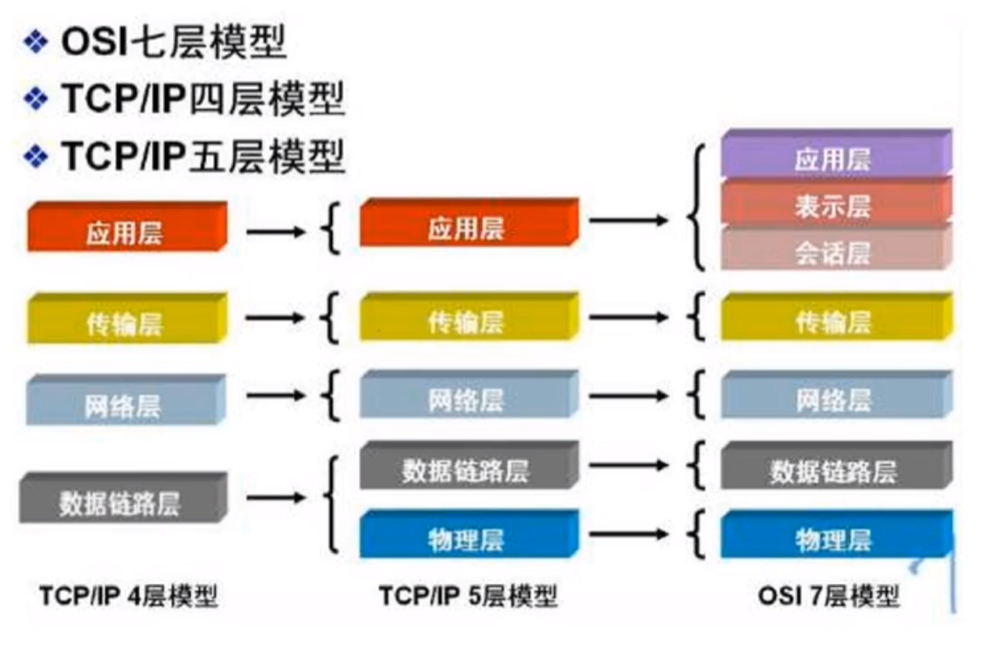

# 网络模型

**引言**：就是平时开发的时候就基本单纯调库，对于底层怎么做的感知不是很多，然后有时候在编写网络编程的时候遇到一些`玄学`问题【特别是数据传输过程中出现问题】得到更好的方法和方向，然后就是尝试自己编写一个网络协议栈

## osi七层模型

* 物理层、数据链路层、网络层、传输层、会话层、表示层、应用层

## tcp/ip四层模型

* 数据链路层、网络层、传输层、应用层

## tcp/ip五层模型

* 物理层 + `tcp/ip四层`

