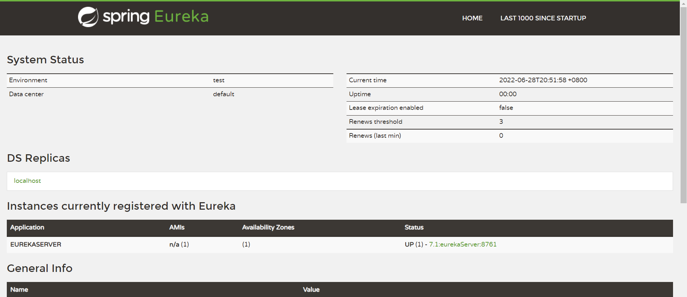
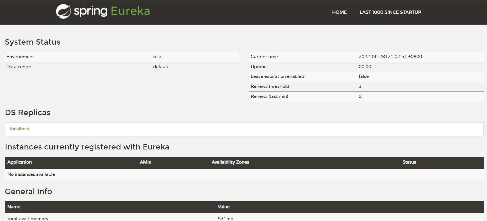
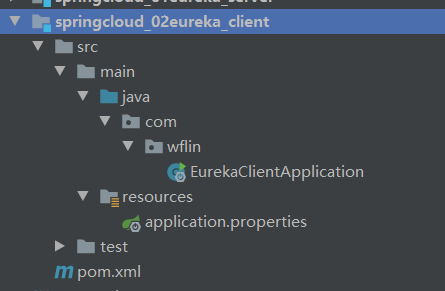
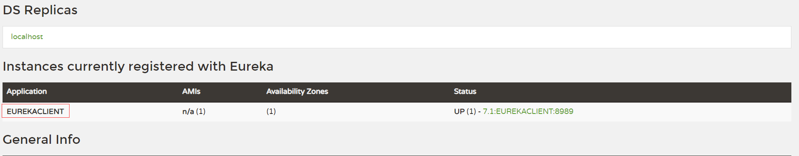
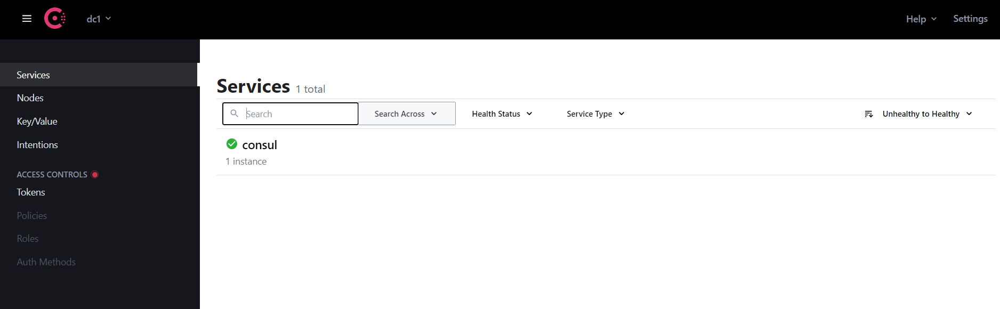
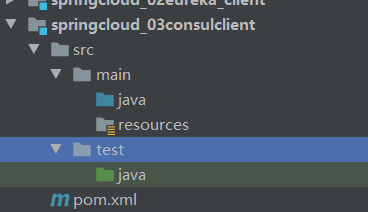

# 一、springcloud引言，命名，版本选择

[官方链接]([Spring Cloud](https://spring.io/projects/spring-cloud))

## 定义

* **官方定义**：springcloud 是为开发人员提供了在分布式系统中快速构建一些通用模式的工具
* **通俗定义**：springcloud 含有众多子项目的工具集 tools collection 微服务的工具集合

## 微服务

* 基于单体，基于业务进行拆分，每个服务都是独立应用，独立部署，运行在自己的计算机进程（相对服务器的计算机而言），对于这些服务都是分布式管理

## springcloud命名 & springboot版本选择（重要）

* **springcloud **
  * **命名**：早期没有选择数字命名【现在】
  * **定义**：springcloud 涵盖众多子项目工具集 服务发现 服务注册 负载均衡，子项目版本使用的数字
  * **早期命名**：选择伦敦地铁站名字作为发布版本

### springcloud 与 springboot 对应关系

| Release Train                                                | Boot Version                          |
| :----------------------------------------------------------- | :------------------------------------ |
| [2021.0.x](https://github.com/spring-cloud/spring-cloud-release/wiki/Spring-Cloud-2021.0-Release-Notes) aka Jubilee | 2.6.x                                 |
| [2020.0.x](https://github.com/spring-cloud/spring-cloud-release/wiki/Spring-Cloud-2020.0-Release-Notes) aka Ilford | 2.4.x, 2.5.x (Starting with 2020.0.3) |
| [Hoxton](https://github.com/spring-cloud/spring-cloud-release/wiki/Spring-Cloud-Hoxton-Release-Notes) | 2.2.x, 2.3.x (Starting with SR5)      |
| [Greenwich](https://github.com/spring-projects/spring-cloud/wiki/Spring-Cloud-Greenwich-Release-Notes) | 2.1.x                                 |
| [Finchley](https://github.com/spring-projects/spring-cloud/wiki/Spring-Cloud-Finchley-Release-Notes) | 2.0.x                                 |
| [Edgware](https://github.com/spring-projects/spring-cloud/wiki/Spring-Cloud-Edgware-Release-Notes) | 1.5.x                                 |
| [Dalston](https://github.com/spring-projects/spring-cloud/wiki/Spring-Cloud-Dalston-Release-Notes) | 1.5.x                                 |

# 二、环境搭建

* 使用 idea 创建一个空工程

* 创建一个 maven 的父工程

  ```xml
  <?xml version="1.0" encoding="UTF-8"?>
  <project xmlns="http://maven.apache.org/POM/4.0.0"
           xmlns:xsi="http://www.w3.org/2001/XMLSchema-instance"
           xsi:schemaLocation="http://maven.apache.org/POM/4.0.0 http://maven.apache.org/xsd/maven-4.0.0.xsd">
      <modelVersion>4.0.0</modelVersion>
  
  </project>
  ```

* 引入 springcloud 的版本管理

  ```xml
  <!--自定义 propertites-->
  <properties>
      <java.version>1.8</java.version>
      <spring.cloud-version>Hoxton.SR6</spring.cloud-version>
  </properties>
  
  <!--维护版本-->
  <dependencyManagement>
      <dependencies>
          <!--维护 springclould 版本-->
          <dependency>
              <groupId>org.springframework.cloud</groupId>
              <artifactId>spring-cloud-dependencies</artifactId>
              <version>${spring.cloud-version}</version>
              <type>pom</type>
              <scope>import</scope>
          </dependency>
      </dependencies>
  </dependencyManagement>
  ```

* 在父项目中继承 springboot 父项目

  ```xml
  <!--继承 springboot 的父项目-->
  <parent>
      <groupId>org.springframework.boot</groupId>
      <artifactId>spring-boot-starter-parent</artifactId>
      <version>2.2.5.RELEASE</version>
  </parent>
  ```

# 三、服务注册中心


* **定义**：服务注册中心就是在整个微服务的架构中单独提出一个服务，这个服务不完成系统的任何业务功能，仅仅用来完成对整个微服务的服务注册和服务发现，以及对服务健康状态的监控和管理功能；以及服务元信息的存储。

  ```markdown
  # 1 服务注册中心
  - 可以对所有微服务的信息进行存储，如微服务名称、IP、端口等
  - 可以进行服务调用时通过服务发现查询可用的微服务列表及网络地址进行服务调用
  - 可以对所有的微服务进行心跳检查，如果发现某实例长时间无法访问，就会从服务注册表移除该实例
  ```

# 四、常用的注册中心

* springcloud 支持多种注册中心 **Eureka(netflix)，Consul(Go)、Zookeeper(java)**，以及阿里巴巴推出的 **Nacos(java阿里巴巴)**。这些注册中心在本质上都是用来管理服务的注册和发信啊以及服务的状态检查的。

# 五、Eureka

```markdown
- Eureka 是 Netflix 开发的服务发现框架 SpringCloud-NetFlix-eureka 服务注册中心
- Eureka 包含两个组件：Eureka Server 和 Eureka Client
```

### 2、开发 EurekaServer

* 新建一个 eurekaServer 的 module，parent 中写入前面的父 pom

* 在pom 中导入 springboot 依赖，并导入 eureka-server 的依赖

  ```xml
    <dependencies>
          <dependency>
              <groupId>org.springframework.boot</groupId>
              <artifactId>spring-boot-starter-web</artifactId>
          </dependency>
  
  
          <!--引入 EurekaServer 中心-->
          <dependency>
              <groupId>org.springframework.cloud</groupId>
              <artifactId>spring-cloud-starter-netflix-eureka-server</artifactId>
          </dependency>
      </dependencies>
  ```

* 在对应包下创建一个 EurekaServerApplication 主启动类

  ```java
  @SpringBootApplication
  @EnableEurekaServer // 开启当前应用是一个服务注册中心
  public class EurekaServerApplication {
      public static void main(String[] args) {
          SpringApplication.run(EurekaServerApplication.class,args);
      }
  }
  ```

  

* 在 resource 目录下新建一个 application.properties 文件,写入 eurekaServer 的配置信息

  ```properties
  #默认端口
  server.port=8761
  
  # 指定服务名称 <推荐大写，因为服务名在注册中心默认就是大写> [必填]
  spring.application.name=EUREKASERVER
  
  #eureka server 服务注册中心地址,暴露服务地址
  eureka.client.service-url.defaultZone=http://localhost:8761/eureka
  ```

* 此时访问 `http://localhost:8761` 地址就可以看到注册中心的页面了

  

* 此时有一个问题，就是 Eureka-Server 也被当成了一个客户端被注册进去了，所以这是不科学的。改进配置文件

* application.porperties

  ```properties
  #默认端口
  server.port=8761
  
  # 指定服务名称 <推荐大写，因为服务名在注册中心默认就是大写>
  spring.application.name=EUREKASERVER
  
  #eureka server 服务注册中心地址,暴露服务地址
  eureka.client.service-url.defaultZone=http://localhost:8761/eureka
  
  # 关闭 eureka 的立即注册默认是true，【立即注册】，改为 false 就会关闭立即注册
  eureka.client.fetch-registry=false
  
  # 让当前应用只被当成服务注册中心
  eureka.client.register-with-eureka=false
  ```

  

### 3、开发一个 eureka 的客户端

* 拆分出来的微服务

* 创建一个 springboot 项目

  

* 添加 springboot  项目依赖和 Eureka-client 依赖

  ```xml
      <dependencies>
          <!-- springboot 的应用-->
          <dependency>
              <groupId>org.springframework.boot</groupId>
              <artifactId>spring-boot-starter-web</artifactId>
          </dependency>
  
          <dependency>
              <groupId>org.springframework.cloud</groupId>
              <artifactId>spring-cloud-starter-netflix-eureka-client</artifactId>
          </dependency>
      </dependencies>
  ```

* 创建 EurekaClientApplication 启动类

  ```java
  @SpringBootApplication
  
  // 让当前微服务作为一个 eurekaServer 客户端 进行服务注册
  @EnableEurekaClient 
  public class EurekaClientApplication {
      public static void main(String[] args) {
          SpringApplication.run(EurekaClientApplication.class,args);
      }
  }
  
  ```

* 在 resource 目录下创建一个 application.properties 配置文件，写入相关配置

  ```properties
  # 指定微服务的端口
  server.port=8989
  
  #指定服务的名称
  spring.application.name=EUREKACLIENT
  
  # 指定服务注册中心地址 <重要>
  eureka.client.service-url.defaultZone=http://localhost:8761/eureka
  ```

* 启动 EurekaServer 和 EurekaClient 访问 http://localhost:8761

  

  > 这里显示了 EurekaClient 的一个客户端

### 4、Eureka 自我保护机制（了解）

### 5、Eureka 集群搭建

### 6、springcloud netflix eureka

* 两个角色：eureka server 服务注册中心，eureka client 微服务
* 不好的消息：eureka 组件1.0（稳定）、2.0版本停止更新
* 不在推荐是使用 eureka 服务注册中心：
  * 最新版本停止更新
  * 每次必须手动通过代码形式开发服务注册中心

# 六、consul 服务注册中心

## 相关简介：

* consul 基于 go 语言进行开发服务注册中心，清凉级服务注册中心 Google
* **作用：** 管理微服务中所有服务注册 发现 管理服务元数据信息存储（**服务名，地址列表**）心跳健康检查。

## consul 服务注册中心安装

* docker 安装运行

  >docker run -d --name consul -p 8500:8500 --name co consul



* 管理界面基本介绍
  * dcl：数据中心名称
  * datacenter：默认为 dcl
  * 指定数据中心启动：consul agent -dev -datacenter=yourCenterName
  * service：当前 consul 服务中注册服务列表
  * 默认：client server 同时启动自己注册自己 会出现一个 consul 的服务
  * nodes：用来查看 consul 的集群节点

## consul client 服务客户端（微服务）

* 创建一个独立的 springboot 应用

  

* 引入 consul 相关依赖

  ```xml
  
  ```

  


