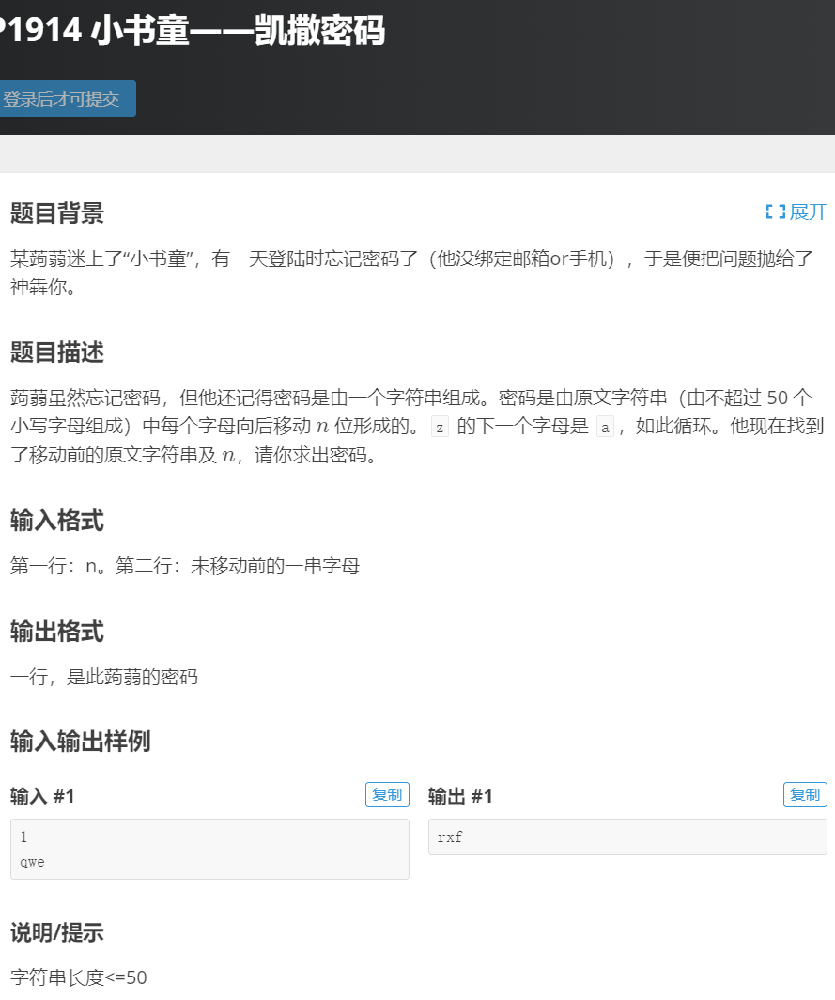
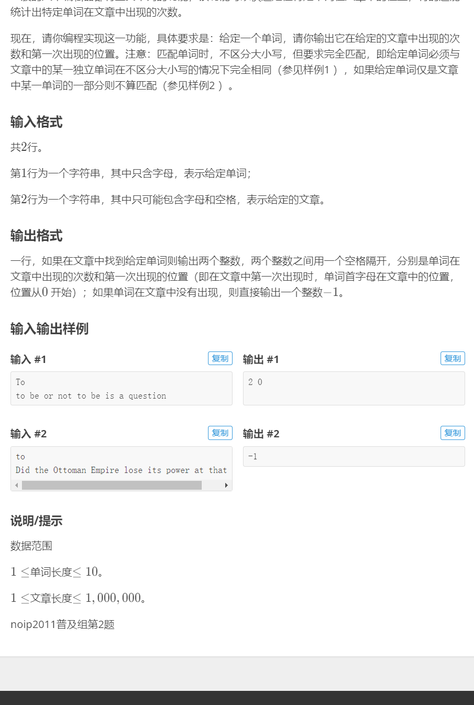
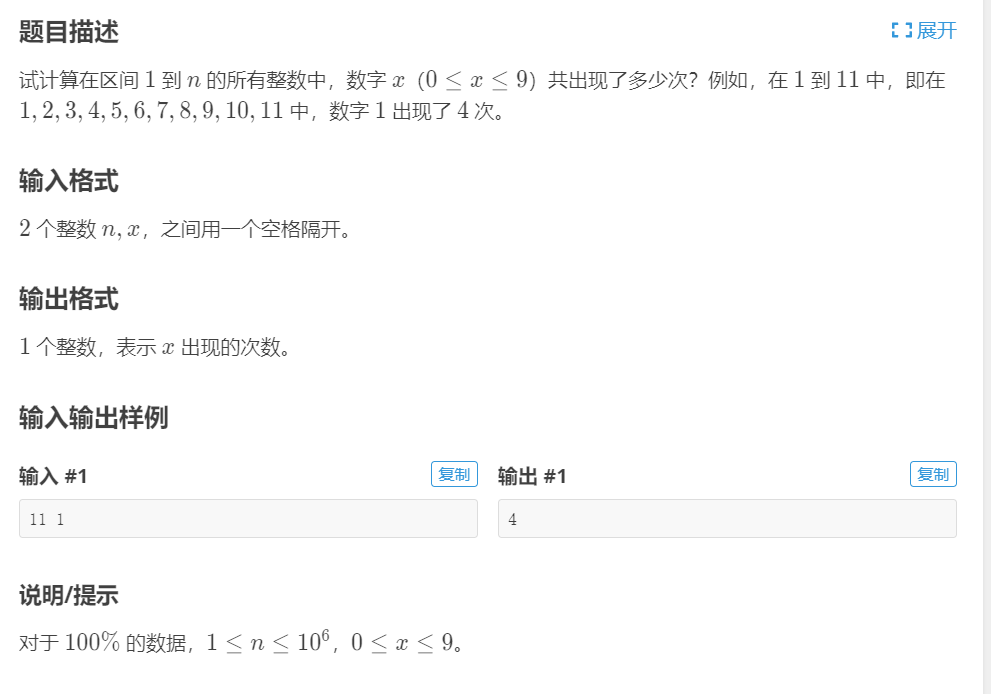
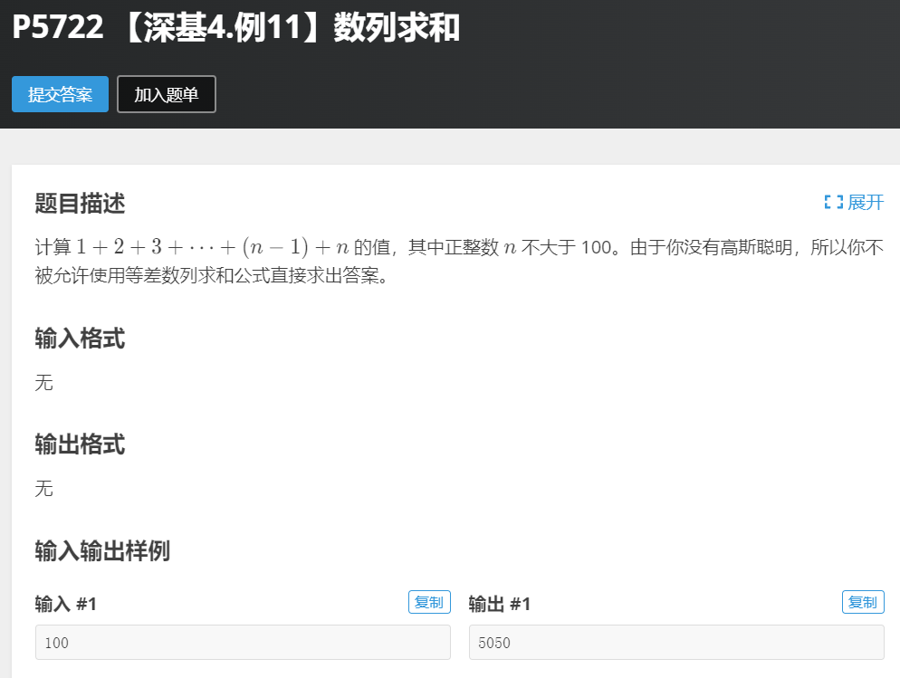
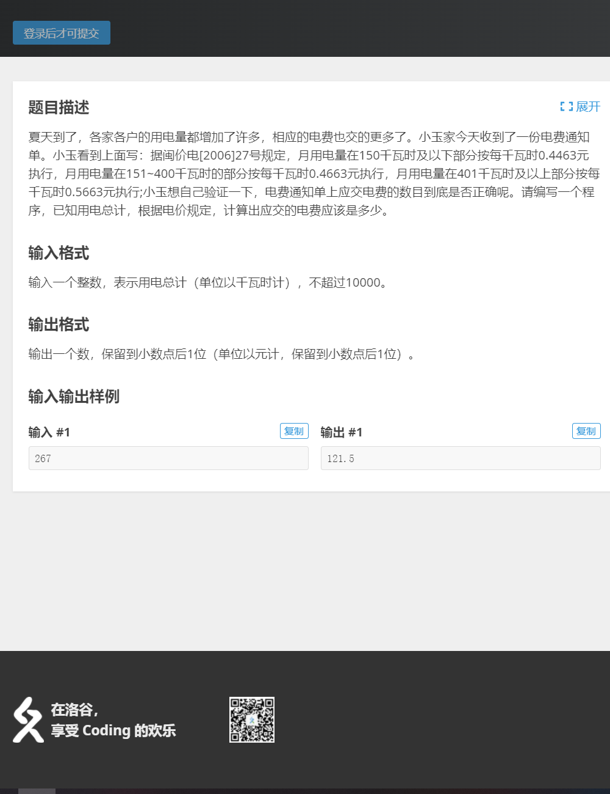

# 第四次题与题解

## 凯撒加密

* 题目来源[传送门](https://www.luogu.com.cn/problem/P1914)

* 题目

  

* 题解

  ```c
  暂时没有
  ```

## 统计单词数

* 题目来源洛谷[传送门](https://www.luogu.com.cn/problem/P1308)

* 题目

  

* 题解

  ```c
  暂时没有
  ```

  

# 第三次题与题解

## 混子题（具体名字我忘了，我以前在哪儿看到的）

* 题目：

  ```txt
  	判辨真假学妹：（有男混子）
  		今天 6 名相互认识的20级同学来私聊 issue 学长，有如下结论：
  		A，B 至少有一人为学妹
  		A，E，F 三人中至少有两人为学妹
  		A，D 不可能都为学妹
  		B，C 性别相同
  		C，D 一男一女
  		如果D不是学妹，则E也不可能是学妹
  		
  	通过编程确定他们的性别
  ```

  

* 题解

  ```c
  #include<stdio.h>
  
  int key = 0;
  int a[6] = {0};
  
  void Switch();
  
  void init()
  {
  	int i; 
  	++key;
  	key %= 3;
  	a[0] = key;
  	for (i = 0; i < 6; i++)
  		if (a[i] == 2 && a[i] != 0)
  		{
  			a[i + 1] += 1;
  			a[i] = 0;
  		}
  
  	Switch();
  }
  
  int methord1()
  {
  	if (a[0] + a[1] >= 1)
  		return 1;
  	return 0;
  }
  
  int methord2()
  {
  	if ((a[0] + a[4] + a[5]) != 0 &&(a[0] + a[4] + a[5]) >= 2)
  		return 1;
  	return 0;
  }
  
  int methord3()
  {
  	if (a[0] + a[3] != 2)
  		return 1;
  	return 0;
  }
  
  int methord4()
  {
  	if (a[1] == a[2])
  		return 1;
  	return 0;
  }
  
  int methord5()
  {
  	if (a[2] + a[3] == 1)
  		return 1;
  	return 0;
  }
  
  int methord6()
  {
  	if (a[3] == 0 && a[4] == 0)
  		return 1;
  	return 0;
  }
  
  void display()
  {
  	int i;
  	for (i = 0; i < 6; i++)
  	{
  		if (a[i] == 0)
  		{
  			printf("%c is M\n", i + 'A');
  		}
  		else if (a[i] == 1)
  		{
  			printf("%c is F\n", i + 'A');
  		}
  		else
  			printf("error\n");
  	}
  }
  
  void Switch()
  {
  	if (methord1()&&methord3()&&methord4()&&methord5()&&methord6())
  		display();
  	else
  		init();
  }
  
  int main()
  {
  	Switch();
  	return 0;
  }
  ```
  
  

## 计数问题

题目来源-洛谷[传送门](https://www.luogu.com.cn/problem/P1980)

* 题目

  

* 题解

  ```c
  // 待定
  #include<stdio.h>
  int trans(int a,char b);
  int trans(int a,char b)
  {
  	char s[10];
  	int j,m,count=0,i=0;
  	while(a>0)
  	{
  		m=a%10;
  		s[i]=m+'0';
  		a=a/10;
  		i++;
  	}
  	i--;
  	j=i;
  	for(i=0;i<=j;i++)
  	{
  		if(s[i]==b)
  		count++;
  	}
  	return count;
  }
  int main()
  {
  	int i,num,count=0;
  	char s;
  	scanf("%d",&num);
  //	printf("num=%d\n",num);
  	getchar();
  	int a[num],b[num];
  	scanf("%c",&s);
  //	printf("s=%c\n",s);
  	if(num>=0&&num<=1000000)
  	if(s>='0'&&s<='9')
  	for(i=0;i<num;i++)
  	{
  		a[i]=i+1;
  //		printf("a[%d]=%-5d",i,a[i]);
  	}
  //	putchar('\n');
  	for(i=0;i<num;i++)
  	{
  		b[i]=trans(a[i],s);
  //		printf("b[%d]=%-5d\n",i,b[i]);
  	}
  	for(i=0;i<num;i++)
  	{
  		count+=b[i];
  	}
  	printf("%d",count);
  	return 0;
  }
  ```
  
  


# 第二次题与题解

## 第一个题：数列求和

题目来源-洛谷[传送门](https://www.luogu.com.cn/problem/P5722)

* 题目



* 题解

```c
#include<stdio.h>
int methordOne(){
	int i,count=0;
	for (i = 1; i <= 100; ++i)
		{
			count+=i;
		}
	return count;
}

// 第二种方法循环次数更少，推荐效率高
int methordTwo(){
	int i,j,count;
	for (i = 1,j=100; i==j; ++i,--j)
	{
		count+=(i+j);
	}
	return count;
}
int main(){
	printf("methordOne：%d\n",methordOne());
	printf("methordTwo：%d\n",methordTwo());
	return 0;
}
```

## 第二题：小玉家的电费

题目来源-洛谷[传送门](https://www.luogu.com.cn/problem/P1422)

* 题目



* 题解

```c
#include<stdio.h>
int main()
{
	int num;
	scanf("%d",&num);
	if(num>=0&&num<=10000)
	if(num<=150)
	printf("%-.1f",(float)num*0.4463);
	else if(num>150&&num<=400)
	printf("%-.1f",(float)(num-150)*0.4663+150*0.4463);
	else
	printf("%-.1f",(float)(num-400)*0.5663+250*0.4663+150*0.4463);
	return 0;
}
```

* **程序解释：** 

  >printf("%-.1f",(float)(num-150)*0.4663+150*0.4463);

  其中 (flaot) 这个语句是强制转换，将后面的运算结果转换成浮点型，如果不转只会输出整型部分

# 第一次题与题解（群里有/先欠着）
